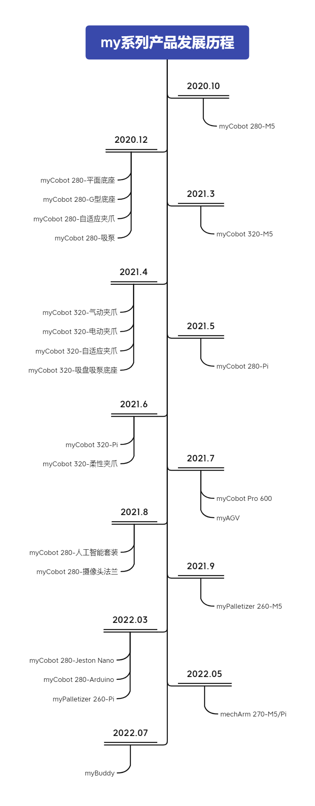

# my系列产品发展历程

### 发展历程

2020.10  -----全球最轻最小的六轴协作机器人myCobot 280-M5问世

2020.12  -----myCobot 280 产品周边上线

2021.03  -----面向科研的最小协作机器人myCobot 320-M5问世

2021.04  -----myCobot 320 产品周边上线

2021.05  -----发布myCobot 280 树莓派版本 

2021.06  -----myCobot 320 树莓派版本问世

2021.07  -----小象协助机械臂商用版 myCobot Pro 600 问世

2021.07  -----发布最小的复合机器人 – 小象移动机器人myAGV

2021.08  -----高级AI套装以及视觉机器-摄像头法兰上线

2021.08  -----全球最紧凑便携的小六轴机械mechArm 270系列问世

2021.09  -----全球首款全包裹式的四轴机械臂-小象码垛机械臂myPalletizer问世

