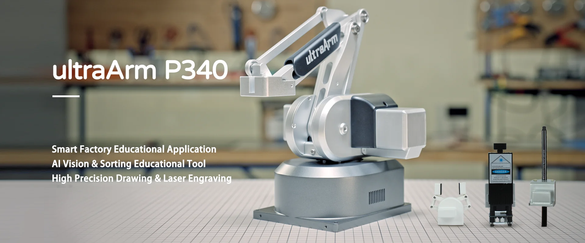

# Hardware introduction
## 1 Equipment List

|Equipment picture|Equipment name|Equipment quantity|
|--------|-------|--------|
||ultraArm P340|2|
||USB Camera 2D|2|
||Camera Stand|2|
||Conveyor belt|1|
||Conveyor Controller|1|
||Vertical suction pump|2|
||Quick-change servos|2|
||Kit base plate|1|
||QR code stickers (set) |1|
||Identification block 3*3cm|20|
||USB docking station|1|

## 2 Equipment parameters
### 2.1 UltraArm P340 robotic arm parameters

|Project|Parameters|
|--------|-------|
|Model|ultraArm P340|
|Degrees of freedom|3DOF/4DOF|
|Payload|650g|
|Working Radius|340mm|
|Repeat positioning accuracy|±0.1mm|
|Weight|2.9kg|
|Service life|5000 hours, support 7X24 hours|
|Input power supply|12V 5A|
|Joint range|J1:-150° ~ +170°;J2:-20° ~ 90°;J3:-5° ~ 75°|
|Noise|60 dB|
|Maximum end speed|100mm/s|
|Power adapter|100-240VAC 50-60Hz|
|Base interface|Laser engraving interface;Adaptive gripper interface;Suction pump interface;Burning switch|
|TCP end speed|100 mm/s|
|Installation method|Desktop horizontal installation|
|Power module|High performance stepper motor|
|Programming methods|Elephant Luban, graphical programming myBlockly, Python, ROS1/ROS2|
|Operating temperature|0°~45°|
|Working environment humidity|5%-80%|

### 2.2 Camera parameters

|Project|Parameters|
|--------|-------|
|Camera name|USB distortion-free camera|
|Image pixels|2M 1080p|
|Supported image formats|650g|
|Pixel size|3.0umx3.0um|
|Maximum frame rate|MJPG: 1920 1080@30fps; YUV: 1920 1080@30fps|
|USB Protocol|USB2.0 HS/FS|
|Supported resolutions|1280X720, 640X480, 320X240|
|Power supply|12V 5A|
|Supported resolutions|1280X720, 640X480, 320X240|
|Field of view|110° without distortion|
|Supported systems|Windows XP/7/8/10/VISTA/SEVEN/MAC LINUX(include uvc)/Raspberry Pi/Android 4.2+|

### 2.3 Conveyor belt parameters

|Project|Parameters|
|--------|-------|
|Motor type|Stepper motor|
|Controller|Mega 2560 Control Board|
|Power supply|DC24V|
|Conveyor belt length|800mm|
|Maximum running speed|0.5m/s|
|Conveyor belt width|100mm|
|Conveyor belt height|60mm|
|Loading capacity|500g|

---
[← Previous page](../2.1-Product_Introduction.md) | [Next page → ](./2.2-Hardwareinstall.md)