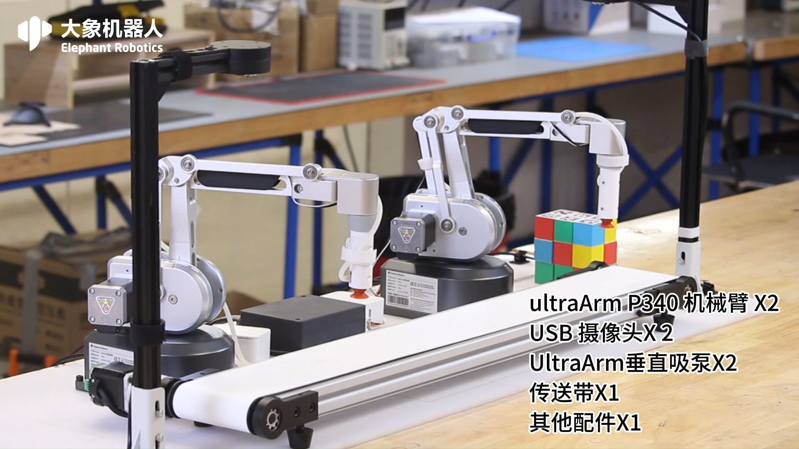

# 硬件介绍
## 1 设备清单
| 设备名称 &nbsp;&nbsp;&nbsp;&nbsp;&nbsp;&nbsp;&nbsp;&nbsp;&nbsp;&nbsp;&nbsp;&nbsp;&nbsp;&nbsp;&nbsp;&nbsp;&nbsp;&nbsp;&nbsp;&nbsp;&nbsp;&nbsp;&nbsp;&nbsp;&nbsp;&nbsp;&nbsp;&nbsp;&nbsp;&nbsp;&nbsp;&nbsp;  |  数量 &nbsp;&nbsp;&nbsp;&nbsp;&nbsp;&nbsp;&nbsp;&nbsp;&nbsp;&nbsp;&nbsp;&nbsp;&nbsp;&nbsp;&nbsp;&nbsp;&nbsp;&nbsp;&nbsp;&nbsp;&nbsp;&nbsp;&nbsp;&nbsp;&nbsp;&nbsp;&nbsp;&nbsp;&nbsp;&nbsp;&nbsp;&nbsp;&nbsp;&nbsp;&nbsp;&nbsp;&nbsp;&nbsp;&nbsp;&nbsp;&nbsp;&nbsp;&nbsp;&nbsp;&nbsp;&nbsp;&nbsp;&nbsp;&nbsp;&nbsp;&nbsp;&nbsp;&nbsp;&nbsp;&nbsp; |
|-------------------|-|
| 奥创机械臂   | 2  |
|  舵机  | 2   |
|  吸泵 | 2   | 
| USB 2D相机   | 2   |
| 相机支架   | 2   |
| 传送带   | 1  | 
| 传送带控制盒   | 1   |
|  12V电源  | 2   |
|  24V电源  | 1   |
|  数据线 | 3   |
|  USB拓展坞  | 1   |
|  拼接底板  | 4   |
|  木块  | 18   |
|  二维码贴纸  | 1   |
|  压线夹  | 10   |

## 2 设备介绍

整体介绍

机械臂和吸泵介绍

相机和木块介绍

传送带介绍

传送带控制盒和吸泵控制盒介绍

---
[← 上一页](../2.1-Product_Introduction.md) | [下一页 → ](./2.2-Hardwareinstall.md)