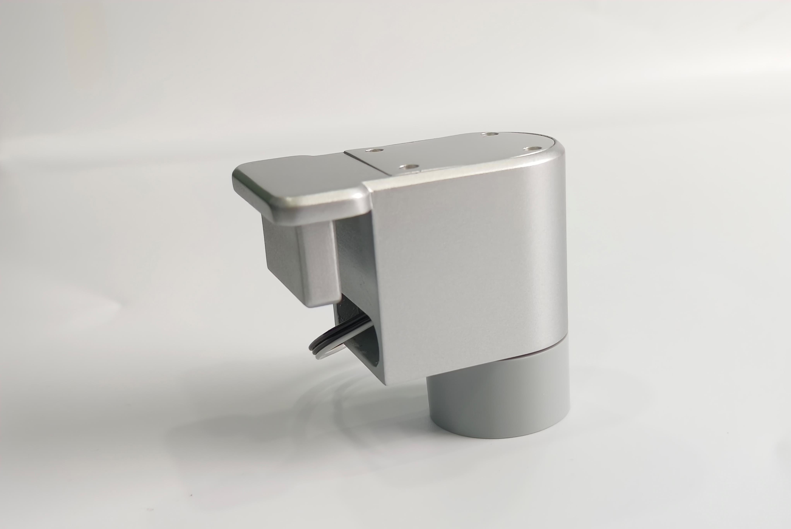

# Hardware Introduction
## 1 Equipment List

|Device images|Device Name|Number of devices|
|--------|-------|--------|
||ultraArm P340|2|
||USB camera 2D|2|
||Camera bracket|2|
||Conveyor belt|1|
||Conveyor belt controller|1|
||Vertical suction pump|2|
||Quick change of servo|2|
||floor|1|
||Aruco code stickers (set)|1|
||Identifying blocks 3*3cm|20|
||USB hub|1|

## 2 Equipment parameters
### 2.1 UltraArm P340 parameters

|project|parameters|
|--------|-------|
|Model | UltraArm P340|
|Degrees of Freedom | 3DOF/4DOF|
|Payload | 650g|
|Working radius | 340mm|
|Repetitive positioning accuracy | ± 0.1mm|
|Weight | 2.9kg|
|Service life | 5000 hours, supporting 7X24 hours|
|Input power | 12V 5A|
|Joint range | J1: -150 °~+170 °; J2: -20 °~90 °; J3: -5 °~75 °|
|Noise | 60 dB|
|Maximum end velocity | 100mm/s|
|Power adapter | 100-240VAC 50-60Hz|
|Base interface | Laser engraving interface; Adaptive gripper interface; Suction pump interface; Burn switch|
|TCP end speed | 100 mm/s|
|Installation method | Desktop horizontal installation|
|Power module | High performance stepper motor|
|Programming method | Elephant Luban, graphical programming myBlockly, Python, ROS1/ROS2|
|Working temperature | 0 °~45 °|
|Working environment humidity | 5% -80%|

### 2.2 Camera parameters
|Project | Parameters|
|--------|-------|
|Camera Name | USB Distortion free Camera|
|Image Pixels | 2M 1080p|
|Supports image formats | 650g|
|Pixel size | 3.0umx3.0um|
|Maximum frame rate | MJPG: 1920 1080@30fps ; YUV: 1920 1080@30fps |
|USB Protocol | USB2.0 HS/FS|
|Supported resolutions | 1280X720640X480320X240|
|Power supply | 12V 5A|
|Supported resolutions | 1280X720640X480320X240|
|Field of view angle | 110 ° without distortion|
|Supported Systems | Windows XP/7/8/10/VISTA/EVEN/MAC LINUX (include uvc)/Raspberry Pi/Android 4.2+|

### 2.3 Conveyor belt parameters
|Project | Parameters|
|--------|-------|
|Motor type | Stepper motor|
|Controller | Mega 2560 Control Board|
|Power supply | DC24V|
|Belt length | 800mm|
|Maximum operating speed | 0.5m/s|
|Belt width | 100mm|
|Belt height | 60mm|
|Carrying capacity | 500g|

---
[← Previous Page](../2.1-Product_Introduction.md) | [Next Page → ](./2.2-Hardwareinstall.md)