# Hardware installation

## 1. Material inspection
Refer to the material list in the previous section to check if the materials are complete

## 2 chassis splicing
Splice the bottom plate according to the reference in the following figure

## 3 Camera module assembly
Prepare the materials for assembling the camera bracket base first
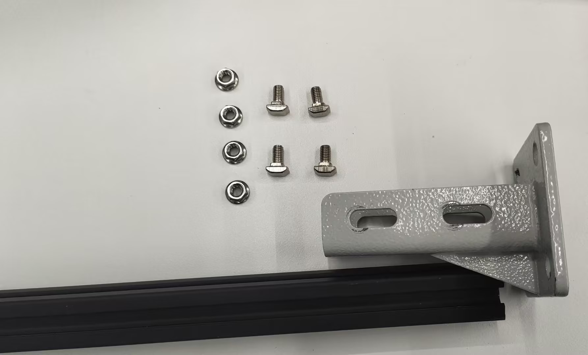 
Place the profile into the base
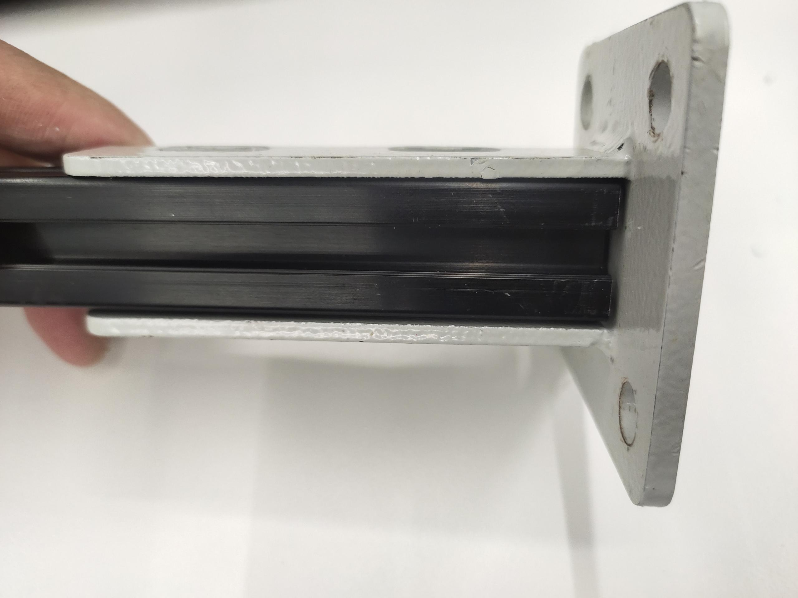
Put the screws into the profile
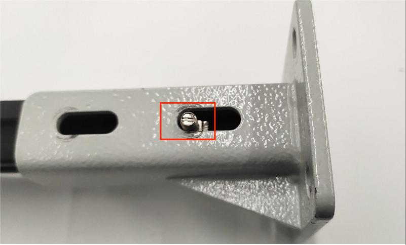
Fix with nuts again
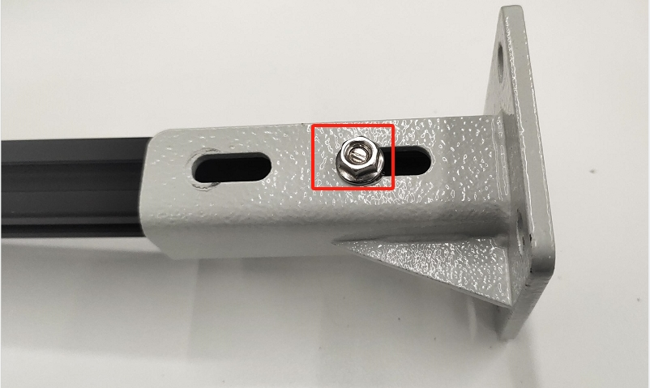
Both sides of the base need to be fixed
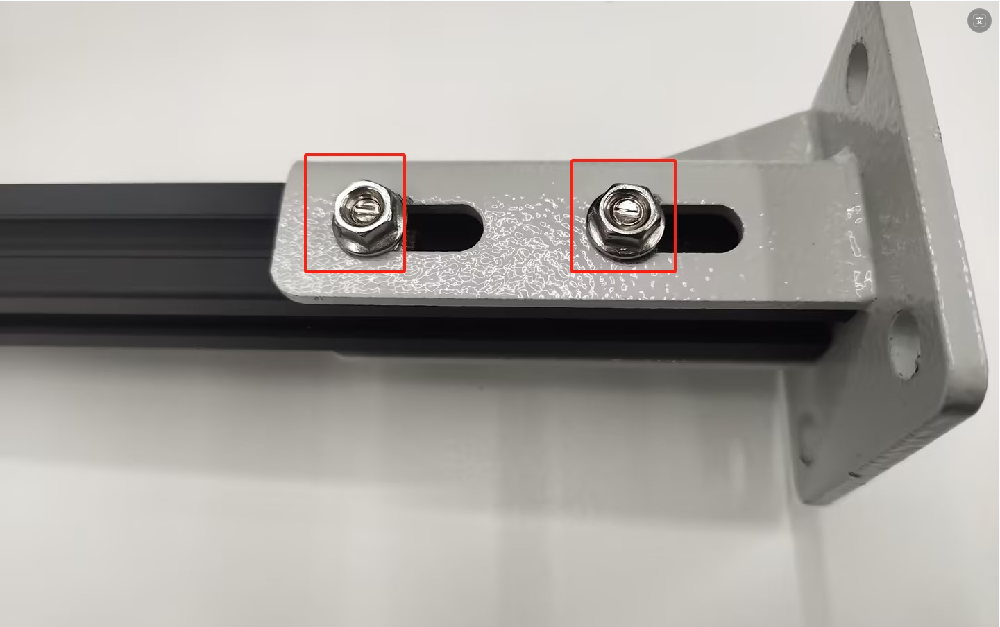
First, place the ship cap nut onto the profile

Use corner codes to connect the two profiles together

Both camera brackets are assembled using the same method
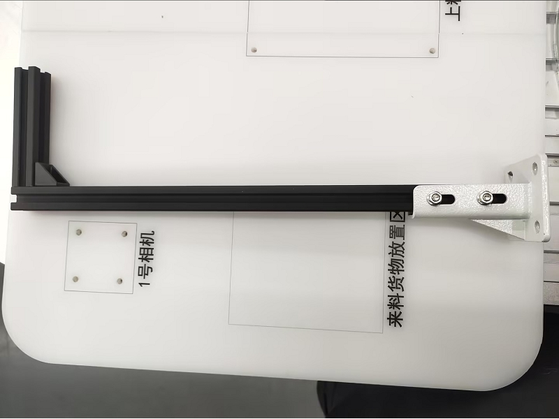
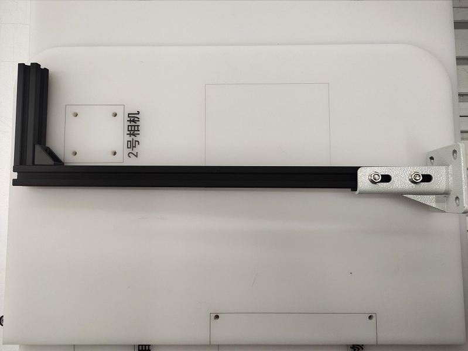

## 4. Installation of conveyor belt module
First, place the conveyor belt on the bottom plate, and then fix the main control box on the bottom plate

Connect the motor wires of the conveyor belt to the conveyor belt

Connect a 24V power supply to the main control of the conveyor belt

Connect the data cable to the main control of the conveyor belt

## Installation of 5 robotic arms
According to the text on the bottom plate, place the two robotic arms in the installation position
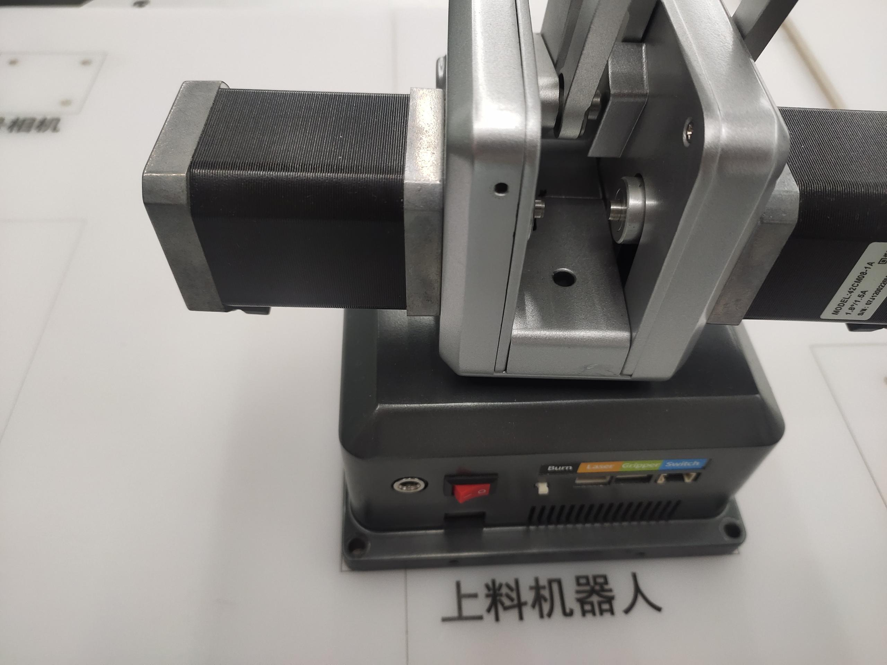
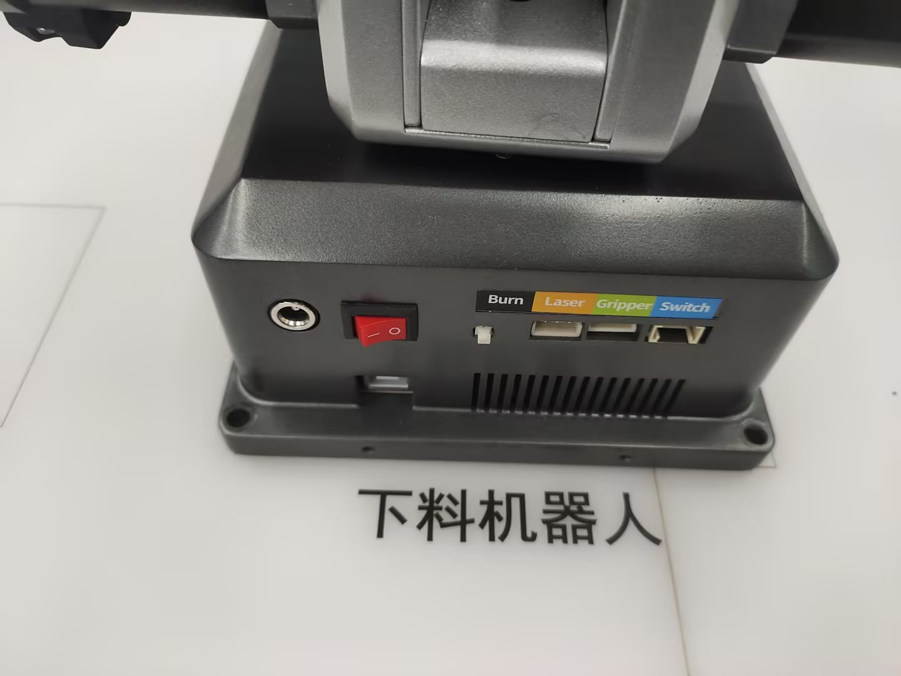

Fix the robotic arm on the base plate, and each robotic arm needs to be fixed with four hex screws

Connect the power and data cables

## 6 Camera installation
Prepare the camera first
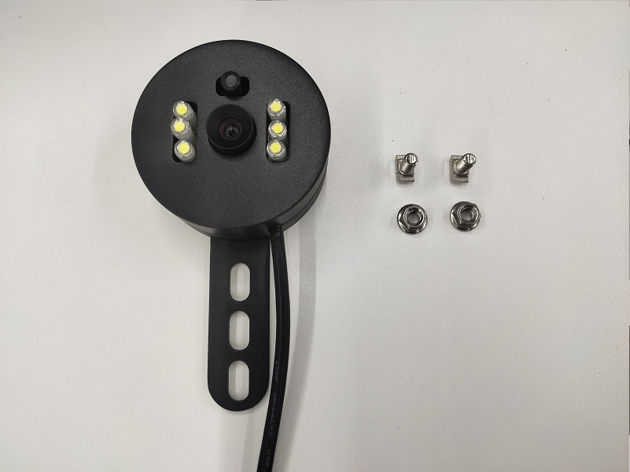
Put the screws into the profile
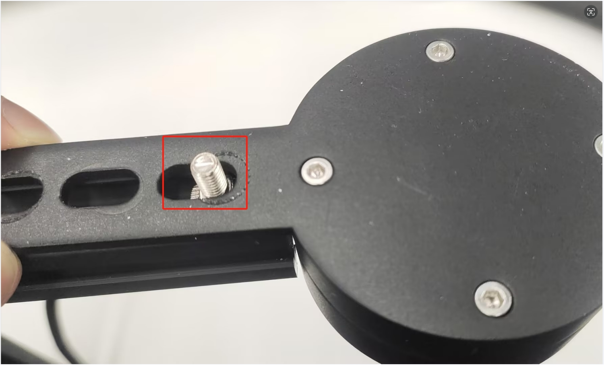
Then fix it with nuts
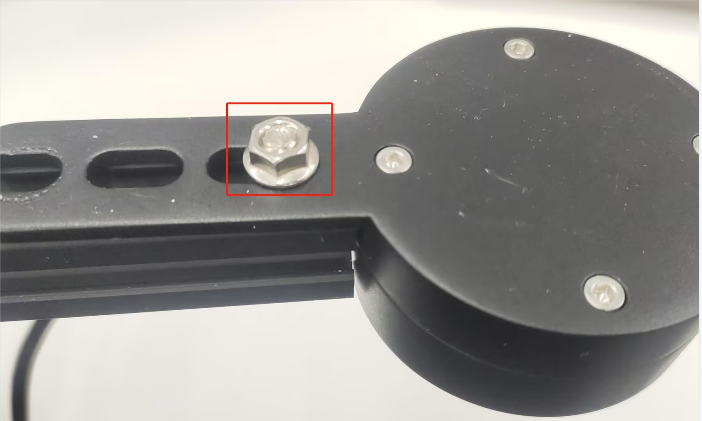
It needs to be fixed with two screws. During installation, pay attention to keeping the camera and profile as horizontal and vertical as possible, otherwise it will affect the camera's grasping accuracy
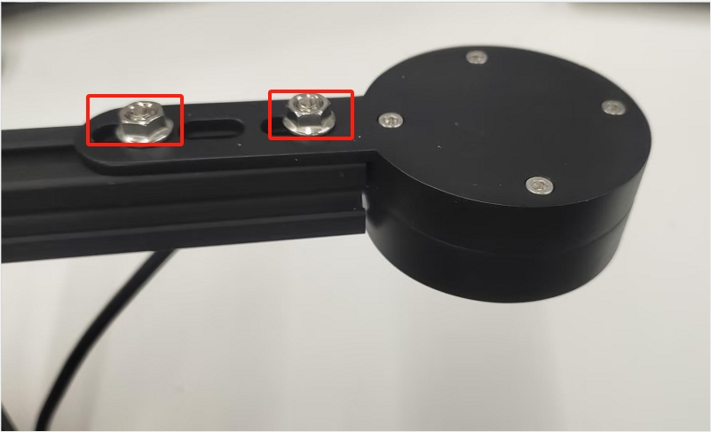
Install camera number 1 onto the base plate
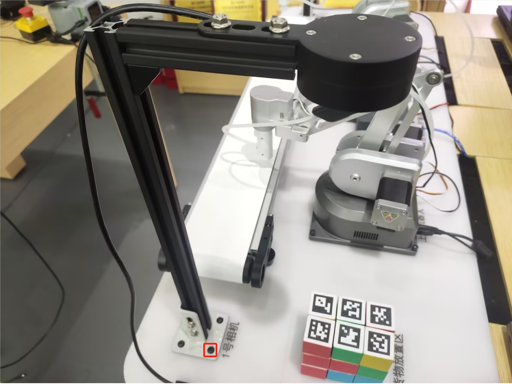
Install camera number 2 onto the base plate
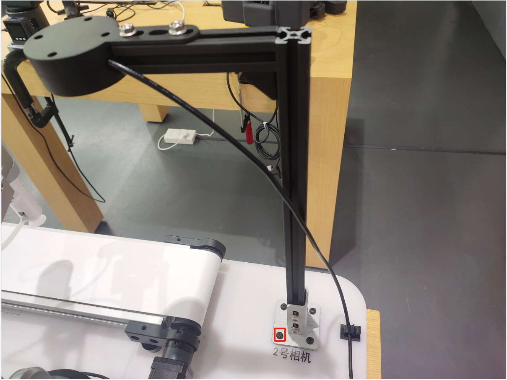

## Installation of 7 end tools
### 7.1 Installation of fixed bracket for air pump box
Fix the fixing bracket of the air pump box on the bottom plate

Fix the air pump box onto the air pump box mounting bracket

Connect the 4-pin wire to the suction pump box

### 7.2 Splicing of servo and end suction pump
Insert the servo cable into either side of the servo

Insert the LEGO connector into the end suction cup connection

Splicing the servo and end suction cups together

Connect the servo wire and suction pump box wire to the end of the robotic arm

**Precautions for installing the end suction cup of the palletizing robot**
There are no special requirements for the stacker robot. The stacker robot needs to be equipped with a servo first, and then use [myblockly] (./2.3 Software Installation. md) to perform a zero return operation on the robot θ Set the angle to -38, then install the suction cup. When installing, the air pipe end of the suction cup should face the robot base, and the wire pipe can be glued with Velcro.

## 8 Final construction effect

---
[← Previous Page](./2.1-HardwareIntroduction.md) | [Next Page → ](./2.3-Softwareinstallation.MD)