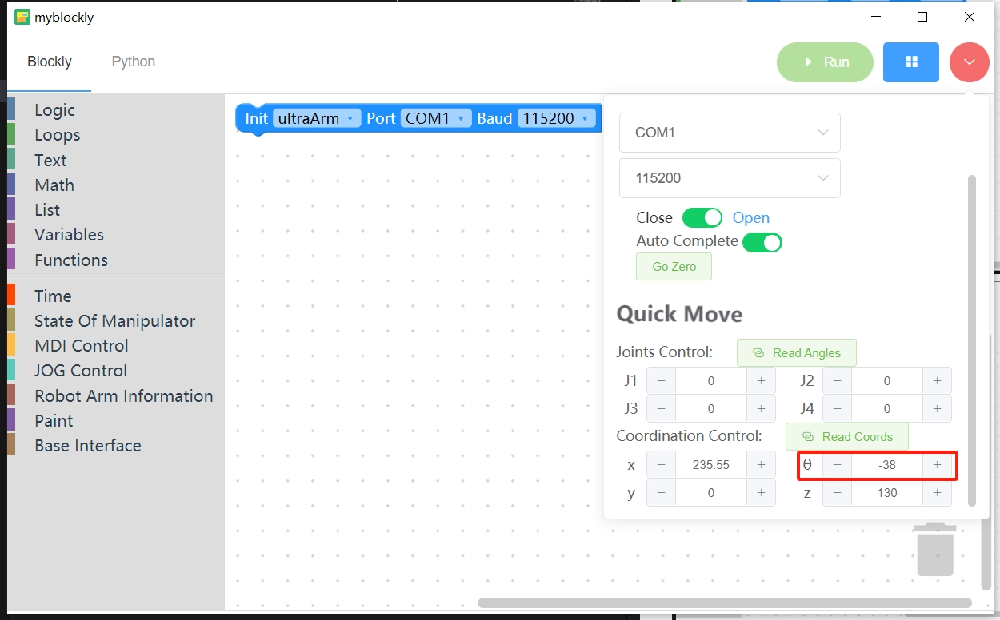

# Hardware Installation

## 1 Material inspection
Refer to the material list in the previous section to see if the materials are complete

## 2 Chassis splicing
Assemble the base plate according to the reference picture below.

## 3 Camera module assembly
First prepare the materials for assembling the camera stand base

Place the profile into the base

Put the screws into the profile

Fix it with nuts

Both sides of the base need to be fixed

First put the cap nut on the profile

Then use the corner code to connect the two profiles

Both camera mounts are assembled the same way

## 4 Conveyor module installation
First place the conveyor belt on the base plate, and then fix the main control box on the base plate

Connect the motor wire of the conveyor belt to the conveyor belt

Connect the 24V power supply to the conveyor belt main control

Connect the data cable to the conveyor belt main control

## 5 Robotic arm installation
According to the text on the base plate, place the two robotic arms into the installation position.

Fix the robotic arm to the base plate. Each robotic arm needs to be fixed with four hexagon socket screws.

Connect the power cord and data cable

## 6 Camera installation
Get your camera ready first

Put the screws into the profile

Then fix it with nuts

It needs to be fixed with two screws. When installing, pay attention to keeping the camera and the profile as horizontal and vertical as possible, otherwise it will affect the camera capture accuracy.

Install camera No. 1 on the base plate

Install camera No. 2 on the base plate

## 7 End tool installation
### 7.1 Air pump box fixing bracket installation
Fix the air pump box holder to the base plate

Fix the air pump box to the air pump box holder

Connect the 4pin wire to the suction pump box

### 7.2 Splicing of steering gear and terminal suction pump
Insert the servo cable into either side of the servo

Insert the LEGO connector into the end suction cup connection

Assemble the servo and the end suction cup

Connect the servo cable and suction pump box cable to the end of the robotic arm

**Notes on installing the end suction cup of the palletizing robot**
There are no special requirements for the depalletizing robot. The palletizing robot needs to install the servo first, use [myblockly](./2.3-Softwareinstallation.md) to return the robot to zero, set the θ angle to -38, and then install it. When installing the suction cup, the air tube end of the suction cup should face the robot base, and the wire tube can be stuck with Velcro.

## 8 Final build effect

---
[← Previous page](./2.1-HardwareIntroduction.md) | [Next page → ](./2.3-Softwareinstallation.MD)