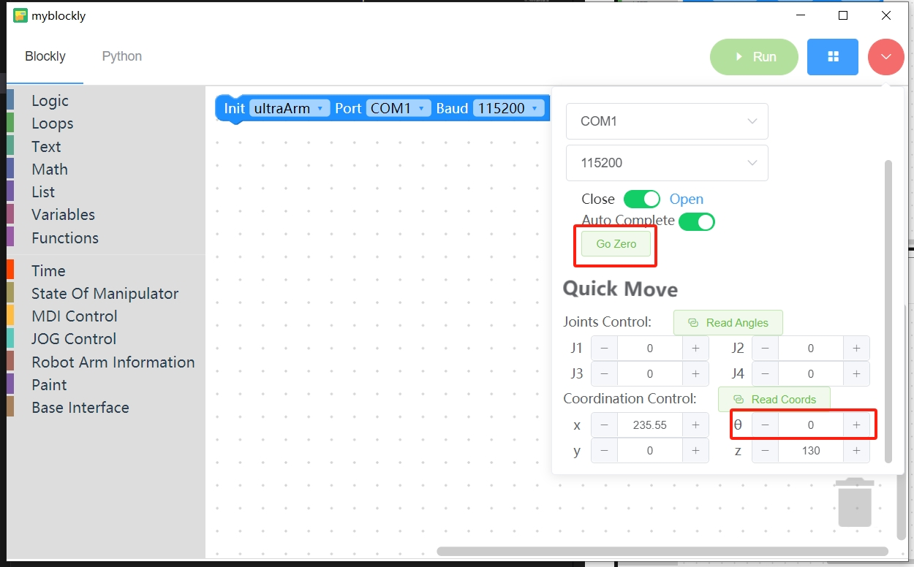

# 硬件安装

## 1 物料检查
参考上一小节的物料清单，查看是否物料齐全

## 2 底盘拼接
将底板按照下图参考拼接起来

## 3 相机模块组装
先将组装相机支架底座的物料准备好
 
将型材放进底座中

将螺丝放进型材里面

再用螺母固定

底座两侧都需要固定

先将船帽螺母放进型材上

再用角码将两根型材连接起来

两个相机支架都是相同的组装方法

## 4 传送带模块安装
先将传送带放到底板上，然后将主控盒固定在底版上

将传送带的电机线接到传送带上

给传送带主控接上24V电源

将数据线接到传送带主控上

## 5 机械臂安装
根据底板上的文字，将两台机械臂放到安装位置上

将机械臂固定在底板上，每个机械臂需要用四颗内六角螺丝固定

接上电源线和数据线

## 6 相机安装
先将相机准备好

将螺丝放进型材里面

然后用螺母固定

需要用两个螺丝固定,安装时注意相机与型材尽量保持水平垂直，否则会影响相机抓取精度

将1号相机安装到底板上

将2号相机安装到底板上

## 7 末端工具安装
### 7.1 气泵盒固定架安装
将气泵盒固定架固定在底板上

将气泵盒固定在气泵盒固定架上

将4pin线接到吸泵盒上

### 7.2 舵机与末端吸泵拼接
将舵机线插入舵机的任意一侧

将乐高连接件插入末端吸盘连接处

将舵机和末端吸盘拼接起来

将舵机线和吸泵盒的线接到机械臂末端

**码垛机器人末端吸盘安装注意事项**
拆垛机器人无特殊要求，码垛机器人需要先装舵机后，先使用[myblockly](./2.3-Softwareinstallation.md)对机器人进行回零操作后，将θ角设置成-38，之后再安装吸盘，安装时，吸盘的气管端要朝着机器人底座，线管可用魔术贴粘住。

## 8 最终搭建效果

---
[← 上一页](./2.1-HardwareIntroduction.md) | [下一页 → ](./2.3-Softwareinstallation.MD)