#  软件搭建

## 1 驱动安装

**串口驱动下载和安装**

串口驱动程序用于机械臂通信，以接收指令，因此使用myStudio烧录固件之前需要下载串口驱动程序。ultraArm需要安装**CP34X** （适用于CH9102版本）驱动程序压缩包。

*注意：对于 Mac OS，在安装之前确保系统 "偏好设置->安全性和隐私->通用" ，并允许从 App Store 和被认可的开发者。*

* ultraArm串口驱动程序：
  * **CP34X**
    * [Windows10](https://download.elephantrobotics.com/software/drivers/CH9102_VCP_SER_Windows.exe)
    * [MACOS](https://download.elephantrobotics.com/software/drivers/CH9102_VCP_MacOS.zip)

  下载完成后点击“安装”。

  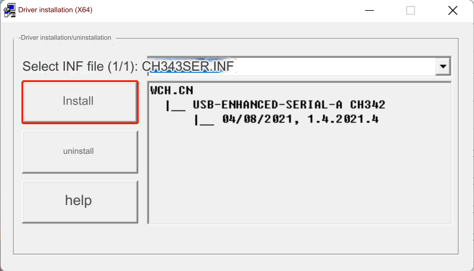

  安装成功后会有提示。

## 2 MyBlockly下载
点击[myBlockly](https://download.elephantrobotics.com/software/myblockly/myblockly-Setup-latest.exe)下载。按照提示进行安装即可。
**注意**：我们只需用myblockly进行回零操作和简单调试即可
### 2.1 myBlockly界面展示

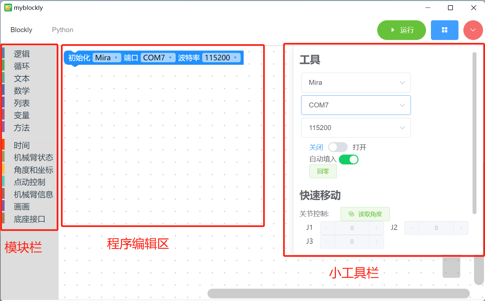

- 模块栏：

  - 包含程序编写所需的方法模块，可以通过鼠标放入程序编辑区进行拼接

- 小工具栏：

  - 点击右上角粉红色按钮会出现一个小工具栏，此处可以选择正确的机型、串口号以及波特率。也可以通过点击“读取角度”或“读取坐标”按钮获取机械臂实时关节角度和坐标。点击关节控制或坐标控制栏中的“+/-”可以控制机械臂移动。

- 程序编辑区域：

  - 运行程序之前需要在初始化模块中或者小工具栏内选择正确的机型、端口以及波特率，否则程序无法正常运行。
  - 把所需的模块方法拖拽到该区域拼接起来实现自己的程序。

**注意**:

1. ultraArm的波特率为115200；
2. 当程序无法运行的时候请检查小工具栏是否断开链接，如下图所示。

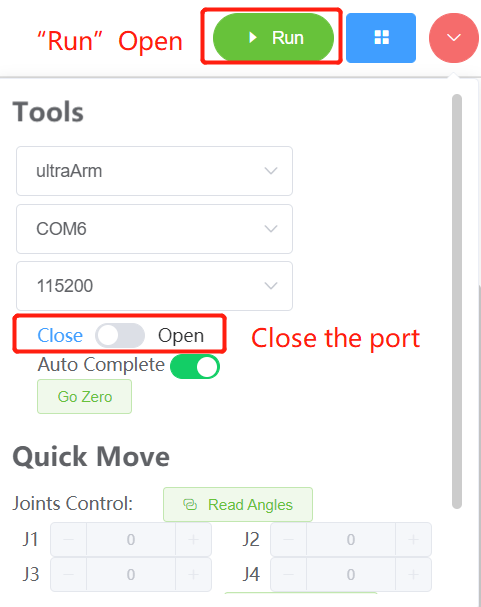

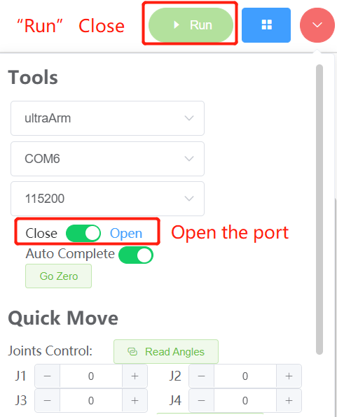

### 2.2 连接电脑

- 如图所示，使用提供的串口线分别连接电脑和机械臂


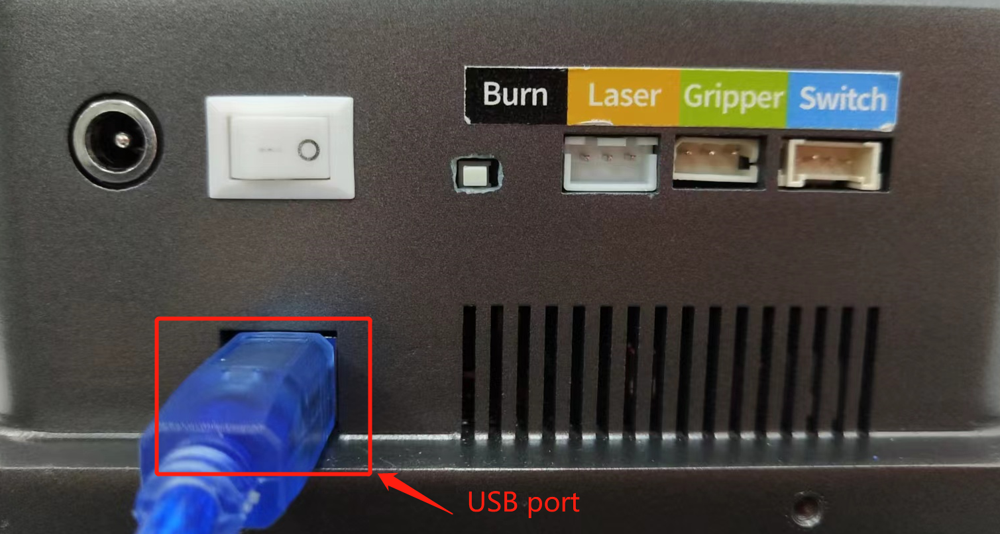


### 2.3 程序运行

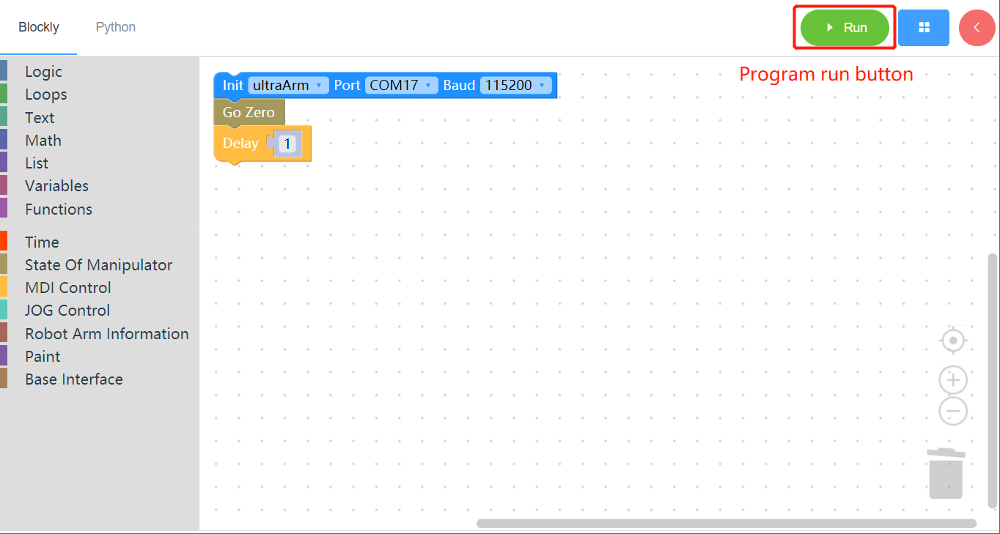

拖动想要的方法模块，编辑自己的程序（如上图所示），每个模块结构相结合在一起后再点击“运行”就可以将代码上传到机械臂当中运行了。

**注意**：ultraArm每次运动之前必须回零，回零之后须加上一个`延迟`模块，给机械臂回零时间再进行下一个运动。

点击左上角“Python”选项可以查阅对应的Python代码，如下图所示。

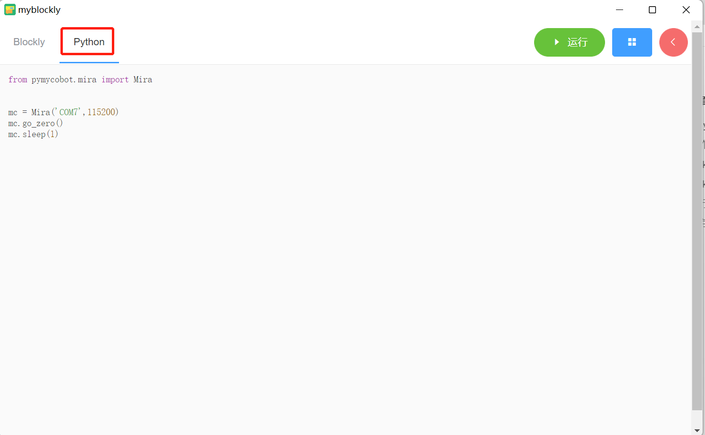

### 2.4 程序保存和载入

myBlockly的程序以*.json格式保存，点击界面右上角蓝色方框，出现“保存”选项点击后，即可保存程序。


同样点击蓝色方框，点击”加载“选项，可以导入已保存的程序。

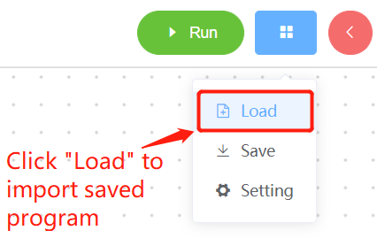

## 3 python安装

> **注意：**安装之前，请先确认您的电脑是64位还是32位。右键点击`我的电脑`，选择`属性`。如下图显示是64位的操作系统，所以选择64位的Python安装包。


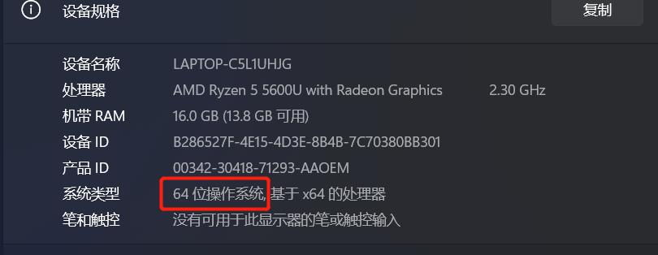

- **Step 1：** Python的下载和安装（建议安装python3.7版本以上）
  - Python官方下载地址： https://www.python.org/downloads/
  - 点击`Downloads`选项，开始下载Python，点击`Add Python 3.10 to PATH`,点击`Install Now`，开始安装Python
  
  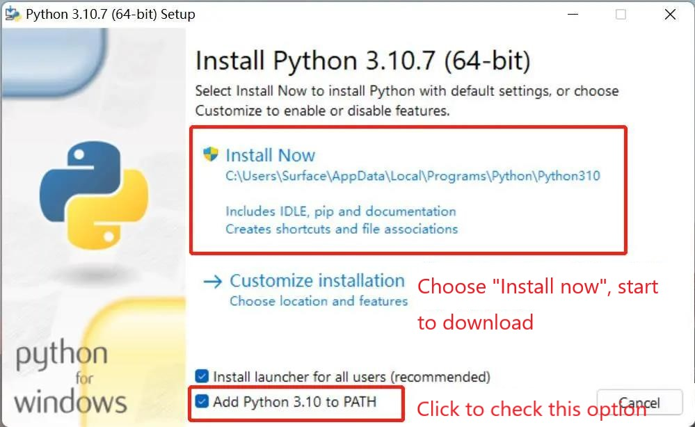
  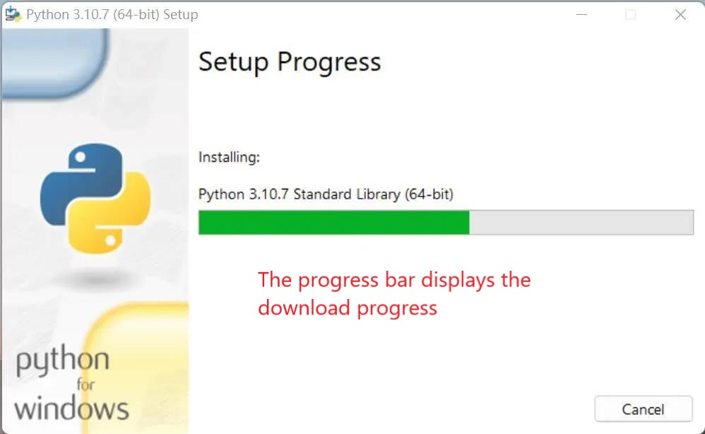
  
  - 出现“Setup was successful”提示，说明安装完成 
  

- **Step 2：** pymycobot安装
  - 指令直接安装，无需克隆下载代码，打开一个控制台终端(快捷键Win+R,输入cmd进入终端)，输入以下命令后按下键盘回车键：

  ```python
  pip install pymycobot --upgrade
  ```
- **Step 3：** 安装opencv
  - 指令直接安装，无需克隆下载代码，打开一个控制台终端(快捷键Win+R,输入cmd进入终端)，输入以下命令后按下键盘回车键：
  ```
    # 二者版本号需保持一致，这里安装4.5.5.62版本
    pip install opencv-python==4.5.5.62
    pip install opencv-contrib-python==4.5.5.62
    ```


---
[← 上一页](./2.2-Hardwareinstall.md) | [下一页 → ](./2.4-Unittesting.md)