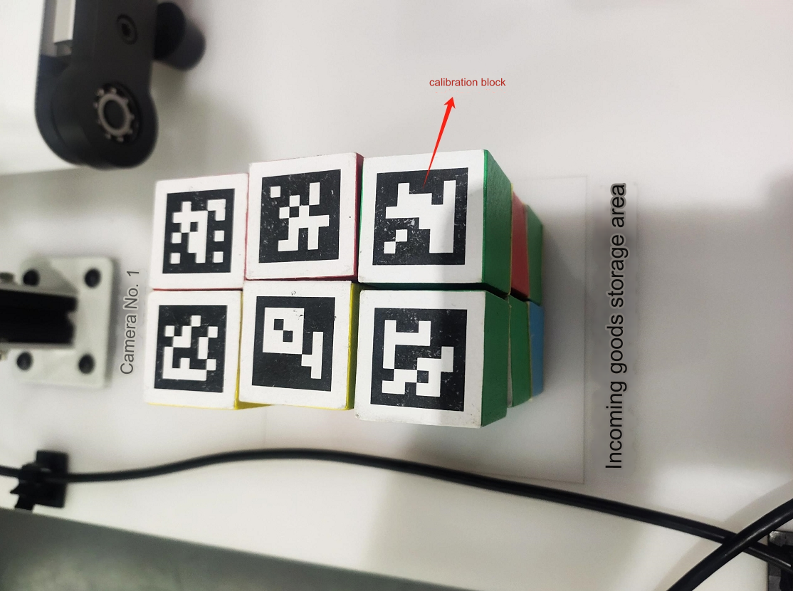
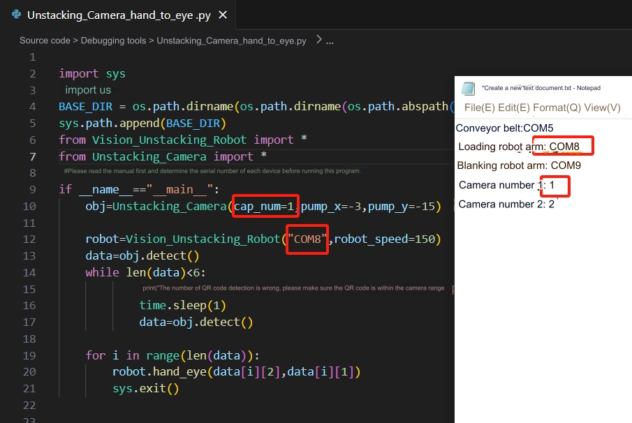
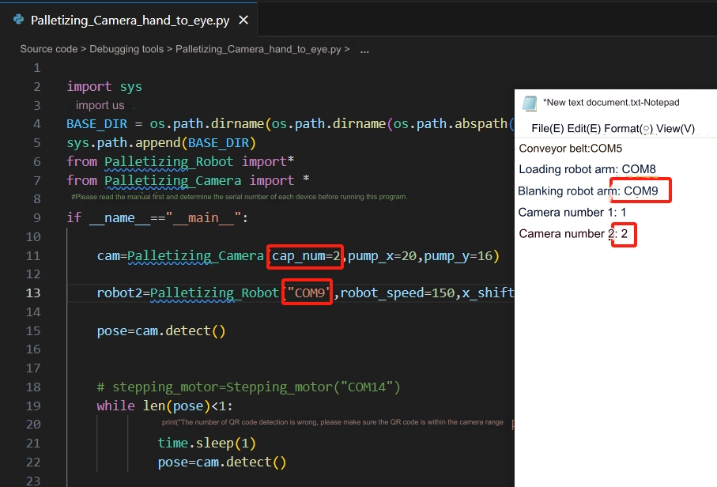

# 单元测试
## 1 文件介绍
'[源代码下载地址](https://github.com/elephantrobotics/UltraArm_P340_Sorting_Kit_docs/tree/ultraarm_sorting_kit_gitbook-cn)

**核心文件介绍**

|文件名|功能|
|---|---|
|Aruco_test.py|相机编号测试|
|Conveyor_test.py|传送带测试|
|Robot_test.py|机械臂及末端工具测试|
|Unstacking_Camera_hand_to_eye.py|1号相机手眼标定|
|Palletizing_Camera_hand_to_eye.py|2号相机手眼标定|
|demo. py|套装功能展示|

## 2 设备连接测试
新建一个记事本文件，方便记录下每个设备的串口号，先将传送带与笔记本连接，在设备管理器查看串口号。

然后按照相同的方法，依次确认上料机械臂和下料机械臂的串口号

然后将两个USB摄像头接入电脑，一个USB拓展坞只能连接一个USB摄像头，另一个摄像头必须与电脑直连，否则会造成数据冲突，在设备管理器查看相机是否连接

## 3 机械臂及末端工具测试
打开Robot_test.py文件，将上料机械臂的串口号填入robot1,再将下料机械臂的串口号填入robot2,运行程序。上料机械臂会先进行回零，然后快换舵机会旋转一个角度，接着会打开吸泵2秒后再关闭。之后下料机械臂会重复上料机械臂刚刚的动作。

## 4 传送带测试
打开Conveyor_test.py程序，将传送带的串口号填入程序中，运行程序，传送带会运动一段时间后，自己停止。

## 5 相机测试
打开Aruco_test.py脚本，确定2个相机的相机编号。电脑会给相机分配编号，在变量cam_num切换1和2来确定哪个是1号相机和2号相机，然后将相机的编号记录下来。

**1号相机编号测试**

若1号相机编号正确，会拍到上料区的画面

**2号相机编号测试**

若2号相机编号正确，会拍到传送带的画面
<!--  -->

## 6 手眼标定
**注意:两台机械臂已经过手眼标定，只需确定相机编号，看实际偏差，根据机械臂基坐标系进行微小调整**

**上料机械臂标定**
将18个木块放到来料货物放置区。

打开Unstacking_Camera_hand_to_eye.py,将上料机械臂的串口号和1号相机的相机编号填入程序中，然后运行程序。观察末端吸盘距离木块中心点有多少偏差，pump_x为末端吸盘对应机械臂基座标系的X方向偏移，pump_y为末端吸盘对应机械臂基座标系下的y方向偏差，标定结束后，不能移动相机和机械臂位置。

通过测量可以看出，末端吸泵距离木块的抓取中心在机械臂基座标的Y轴负方向还差10mm,pump_y的值需要再减少10mm

将pump_y的值在原有的基础上，减少10mm，重新运行程序。若能成功到达木块中心点，就将pump_x和pump_y记录下来。

标定成功参考

**下料机械臂标定**
将一个木块放到2号相机视野下。

打开Palletizing_Camera_hand_to_eye.py,将下料机械臂的串口号和2号相机的相机编号填入程序中，然后运行程序。观察末端吸盘距离木块有多少偏差，pump_x为末端吸盘对应机械臂基座标系的X方向偏移，pump_y为末端吸盘对应机械臂基座标系下的y方向偏移。记录下pump_x和pump_y的值，则标定结束，标定结束后，不能移动相机和机械臂位置。

通过测量可以看出，末端吸泵距离木块的抓取中心在机械臂基座标的X轴正方向还差10mm,pump_x的值需要再增加10mm

将pump_x的值在原有的基础上，增加10mm，重新运行程序。若能成功到达木块中心点，就将pump_x和pump_y记录下来。

标定成功参考

**注意：** 在标定时，不能移动被用来标定的木块

---
[← 上一页](./2.3-Softwareinstallation.MD) | [下一页 → ](./2.5-CompleteRun.md)