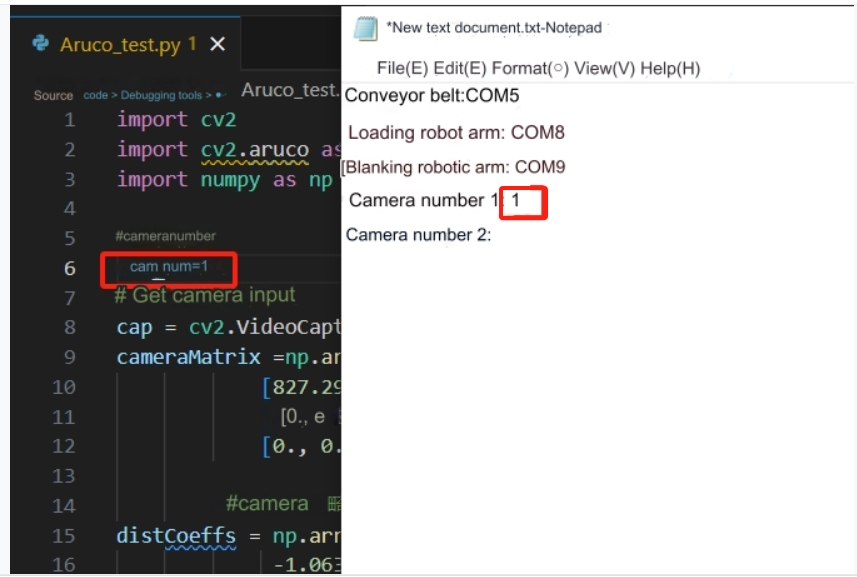
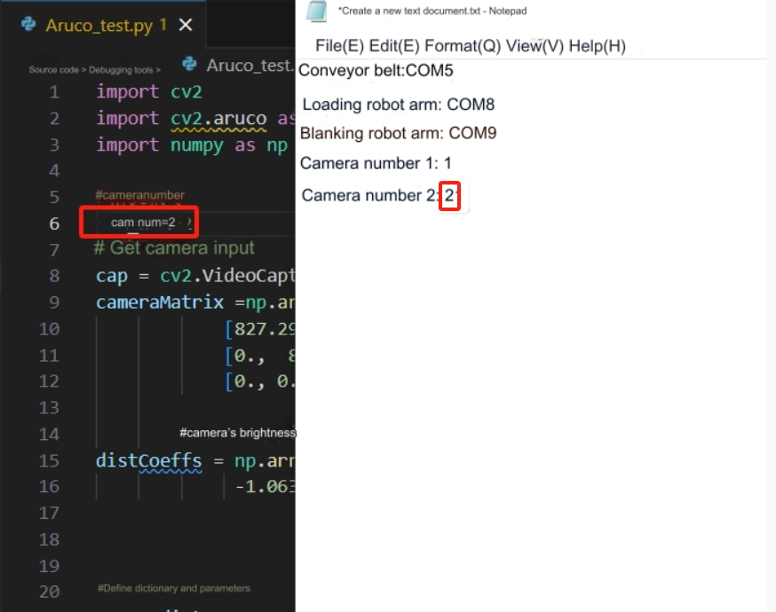
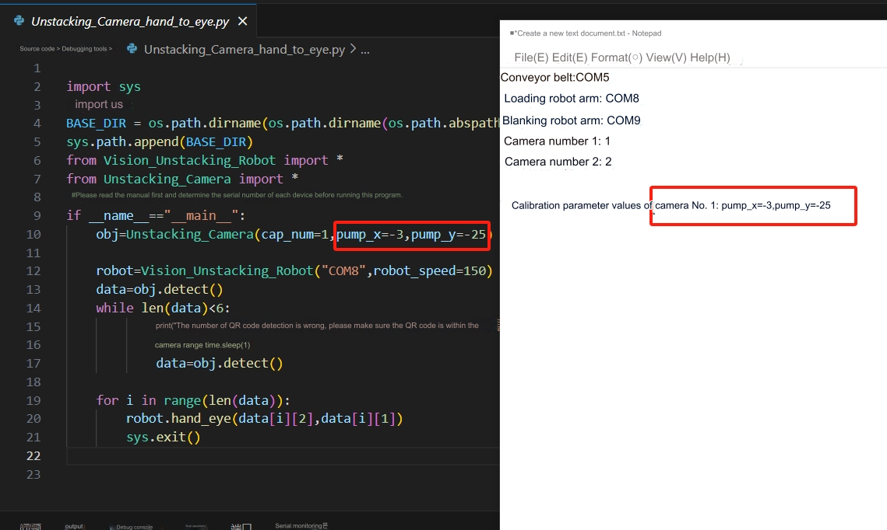

# Unit Test
## 1 File introduction
'[Source code download address](https://github.com/elephantrobotics/UltraArm_P340_Sorting_Kit_docs/tree/ultraarm_sorting_kit_gitbook-en)

**Core file introduction**

|File name|Function|
|---|---|
|Aruco_test.py|Camera number test|
|Conveyor_test.py|Conveyor test|
|Robot_test.py|Robotic arm and end tool test|
|Unstacking_Camera_hand_to_eye.py|Hand-eye calibration of camera No. 1|
|Palletizing_Camera_hand_to_eye.py|Hand-eye calibration of camera No. 2|
|demo.py|Set function display|

## 2 Device connection test
Create a new notepad file to easily record the serial number of each device. First connect the conveyor belt to the notebook and check the serial number in the device manager.

Then follow the same method to confirm the serial numbers of the loading robot arm and the unloading robot arm.

Then connect the two USB cameras to the computer. One USB docking station can only be connected to one USB camera. The other camera must be directly connected to the computer, otherwise it will cause data conflicts. Check whether the camera is connected in the device manager.

## 3 Robotic arm and end tool testing
Open the Robot_test.py file, fill in the serial number of the loading robotic arm into robot1, then fill in the serial number of the unloading robotic arm into robot2, and run the program. The loading robot arm will first return to zero, then the quick-change servo will rotate at an angle, and then the suction pump will be turned on for 2 seconds and then turned off. Afterwards, the unloading robot arm will repeat the action of the loading robot arm.

## 4 Conveyor belt test
Open the Conveyor_test.py program, fill in the serial number of the conveyor belt into the program, and run the program. The conveyor belt will move for a period of time and then stop on its own.

## 5 Camera Test
Open the Aruco_test.py script and determine the camera numbers of the 2 cameras. The computer will assign a number to the camera, switch 1 and 2 in the variable cam_num to determine which is camera No. 1 and camera No. 2, and then record the camera number.

**Camera No. 1 test**

If the number of camera No. 1 is correct, it will take a picture of the loading area.

**Camera No. 2 Test**

If camera number 2 is correct, it will take a picture of the conveyor belt
<!--  -->

## 6 Hand-eye calibration
**Note: The two robotic arms have been calibrated by hand and eye. You only need to determine the camera number, see the actual deviation, and make minor adjustments according to the base coordinate system of the robotic arm**

**Calibration of loading robot arm**
Place 18 wooden blocks in the incoming goods placement area.

Open Unstacking_Camera_hand_to_eye.py, fill in the serial number of the loading robot arm and the camera number of camera No. 1 into the program, and then run the program. Observe the deviation of the end suction cup from the center point of the wooden block. Pump_x is the X-direction offset of the end suction cup corresponding to the robot arm base coordinate system. Pump_y is the y-direction deviation of the end suction cup corresponding to the robot arm base coordinate system. After the calibration is completed, The camera and robotic arm positions cannot be moved.

It can be seen from the measurement that the end suction pump is still 10mm away from the grabbing center of the wooden block in the negative direction of the Y-axis of the robot arm base coordinates. The value of pump_y needs to be reduced by another 10mm.

Reduce the value of pump_y by 10mm based on the original value and rerun the program. If the center point of the wooden block can be successfully reached, pump_x and pump_y will be recorded.

Calibration success reference

**Calibration of unloading robot arm**
Place a wooden block within the field of view of Camera 2.

Open Palletizing_Camera_hand_to_eye.py, fill in the serial number of the unloading robot arm and the camera number of camera No. 2 into the program, and then run the program. Observe the deviation of the end suction cup from the wooden block. Pump_x is the X-direction offset of the end suction cup corresponding to the base coordinate system of the robot arm. Pump_y is the y-direction offset of the end suction cup corresponding to the base coordinate system of the robot arm. Record the values of pump_x and pump_y, then the calibration is completed. After the calibration is completed, the camera and robot arm positions cannot be moved.

It can be seen from the measurement that the end suction pump is still 10mm away from the grabbing center of the wooden block in the positive direction of the X-axis of the base coordinate of the robot arm. The value of pump_x needs to be increased by another 10mm.

Increase the value of pump_x by 10mm based on the original value and rerun the program. If the center point of the wooden block can be successfully reached, pump_x and pump_y will be recorded.

Calibration success reference

**Note:** During calibration, the wooden block used for calibration cannot be moved.

---
[← Previous page](./2.3-Softwareinstallation.MD) | [Next page → ](./2.5-CompleteRun.md)