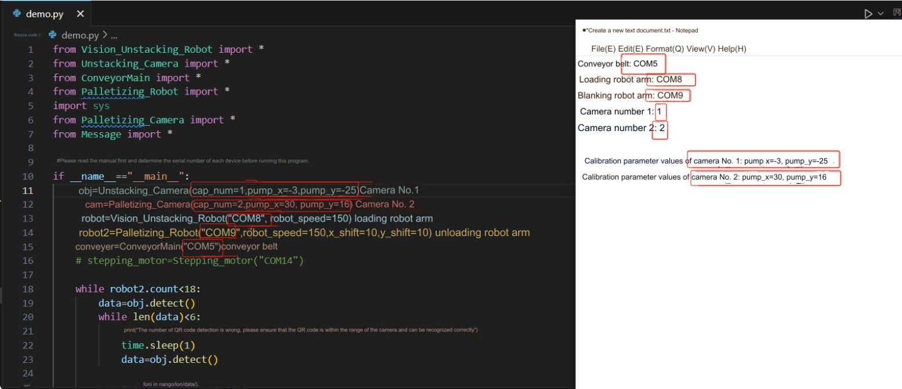

# 功能展示

运行demo.py前，根据上一节记事本记录下的内容，填入到对应类的参数上。然后运行程序即可

<!--  -->

确保拆垛区域能完整拍到并识别6个二维码

程序结束后，码垛区域效果

场景完整运行视频

<video id="my-video" class="video-js" controls preload="auto" width="100%"
poster="" data-setup='{"aspectRatio":"16:9"}'>
  <source src="https://static.elephantrobotics.com/wp-content/uploads/2023/11/%E5%A5%A5%E5%88%9B%E6%99%BA%E8%83%BD%E5%88%86%E6%A0%8B%E5%A5%97%E8%A3%857.mp4"></video>

##  注意事项
程序正常运行后，不要再移动拆垛区域的木块，码垛区域的码垛顺序取决于拆垛区域木块的叠放顺序，因为18个木块上的二维码ID号是唯一的。ID从1-18，码垛机械臂会将木块按照1-3，4-6，7-9，10-12，13-15，16-18，三个木块为一组进行叠放。机械臂在每次关机重启后需先回零。

---
[← 上一页](./2.4-Unittesting.md) | [下一页 → ](../14-IssueFAQ/14-FAQ.md)