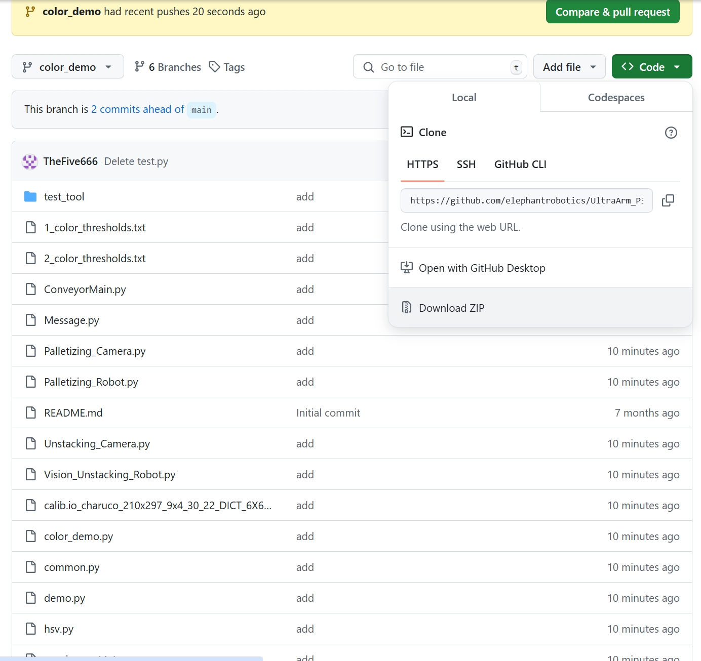
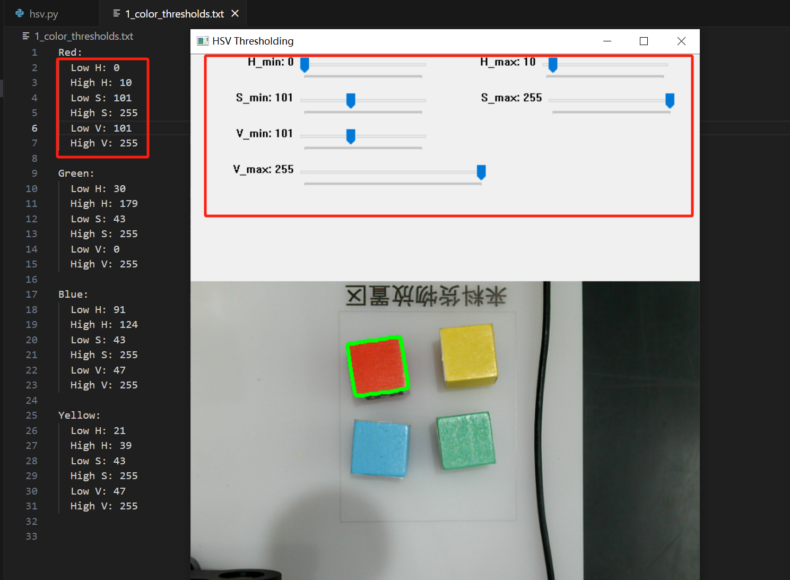
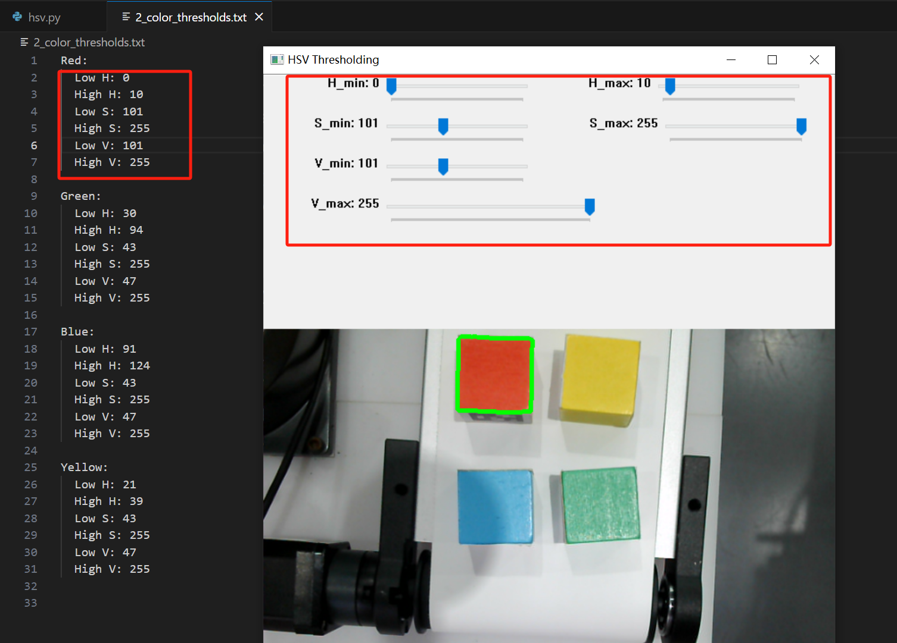
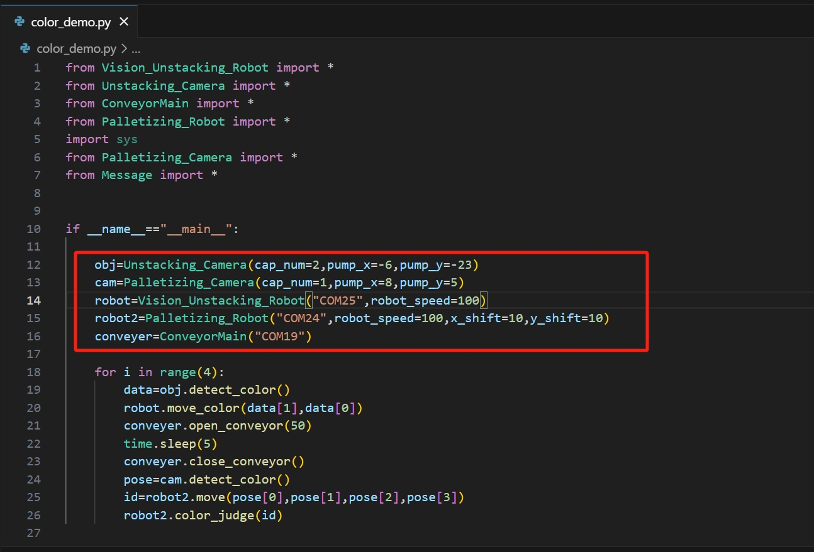

# 颜色分拣案例

**案例描述**：该案例会将红绿蓝黄四个颜色的木块分拣到指定的位置

## 1 案例程序获取
[源代码下载地址](https://github.com/elephantrobotics/UltraArm_P340_Sorting_Kit_docs/tree/ultraarm_sorting_kit_gitbook-cn)

## 2 阈值调整
**注意事项**：在不同光照的条件下，阈值可能不同,可以先运行程序,看看能否正常抓取,如果不,则需要自己调整识别不到的颜色阈值

运行hsv. py文件后,会弹出一个窗口,通过滑块调节阈值,在调到合适的阈值后,会出现一个绿框,将木块框住,再将阈值填写到对应的文件上,1_color_thresholds.txt对应1号相机,2_color_thresholds.txt对应2号相机

下面以红色木块为例子，两个相机分别对红色木块进行阈值调整，将调整后的阈值填写到对应的文件上，其他的颜色的阈值调整，也是同样的方法

## 3 案例复现
根据二维码案例调试的方法,确定好每个设备的串口号和相机编号及手眼标定参数,填入color_demo.py中,然后运行程序即可
若是抓不准,可适当调整手眼标定参数

<video id="my-video" class="video-js" controls preload="auto" width="100%"
poster="" data-setup='{"aspectRatio":"16:9"}'>
  <source src="./img/5.mp4"></video>
