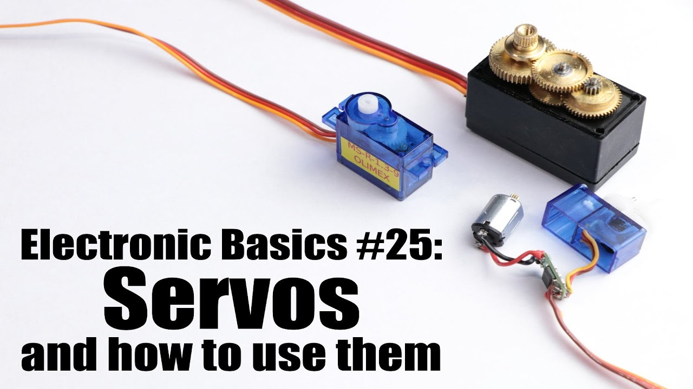

# 电机与舵机

## 电机是什么？

- **1 按工作电源种类划分**：可分为直流电机和交流电机。
    - 1）直流电动机按结构及工作原理可划分：无刷直流电动机和有刷直流电动机。  
        - 有刷直流电动机可划分：永磁直流电动机和电磁直流电动机。  
        - 电磁直流电动机划分：串励直流电动机、并励直流电动机、他励直流电动机和复励直流电动机。  
        - 永磁直流电动机划分：稀土永磁直流电动机、铁氧体永磁直流电动机和铝镍钴永磁直流电动机。  
    - 2）其中交流电机还可划分：单相电机和三相电机。  

- **2 按用途可划分**：驱动用电动机和控制用电动机。  
    - 1）驱动用电动机可划分：电动工具（包括钻孔、抛光、磨光、开槽、切割、扩孔等工具）用电动机、家电（包括洗衣机、电风扇、电冰箱、空调器、录音机、录像机、影碟机、吸尘器、照相机、电吹风、电动剃须刀等）用电动机及其他通用小型机械设备（包括各种小型机床、小型机械、医疗器械、电子仪器等）用电动机。  
    - 2）控制用电动机又划分：步进电动机和伺服电动机等。  

## 舵机是什么？

舵机其实就是伺服电机，因为国内的用户已开始使用在航模等设备的舵轴控制，所以国内对这些轻量级的伺服电机称之为舵机。

### 什么是伺服电机   

**伺服电机（servo motor ）**是指在伺服系统中控制机械元件运转的发动机，是一种补助马达间接变速装置。 
伺服电机可使控制速度，位置精度非常准确，可以将电压信号转化为转矩和转速以驱动控制对象。伺服电机转子转速受输入信号控制，并能快速反应，在自动控制系统中，用作执行元件，且具有机电时间常数小、线性度高等特性，可把所收到的电信号转换成电动机轴上的角位移或角速度输出。分为直流和交流伺服电动机两大类，其主要特点是，当信号电压为零时无自转现象，转速随着转矩的增加而匀速下降。

### 伺服电机的工作原理

- **1.伺服系统（servo mechanism）**是使物体的位置、方位、状态等输出被控量能够跟随输入目标（或给定值）的任意变化的自动控制系统。伺服主要靠脉冲来定位，基本上可以这样理解，伺服电机接收到1个脉冲，就会旋转1个脉冲对应的角度，从而实现位移，因为，伺服电机本身具备发出脉冲的功能，所以伺服电机每旋转一个角度，都会发出对应数量的脉冲，这样，和伺服电机接受的脉冲形成了呼应，或者叫闭环，如此一来，系统就会知道发了多少脉冲给伺服电机，同时又收了多少脉冲回来，这样，就能够很精确的控制电机的转动，从而实现精确的定位，可以达到0.001mm。直流伺服电机分为有刷和无刷电机。有刷电机成本低，结构简单，启动转矩大，调速范围宽，控制容易，需要维护，但维护不方便（换碳刷），产生电磁干扰，对环境有要求。因此它可以用于对成本敏感的普通工业和民用场合。 
无刷电机体积小，重量轻，出力大，响应快，速度高，惯量小，转动平滑，力矩稳定。控制复杂，容易实现智能化，其电子换相方式灵活，可以方波换相或正弦波换相。电机免维护，效率很高，运行温度低，电磁辐射很小，长寿命，可用于各种环境。 

- **2.交流伺服电机也是无刷电机**，分为同步和异步电机，运动控制中一般都用同步电机，它的功率范围大，可以做到很大的功率。大惯量，最高转动速度低，且随着功率增大而快速降低。因而适合做低速平稳运行的应用。

- **3.伺服电机内部的转子是永磁铁**，驱动器控制的U/V/W三相电形成电磁场，转子在此磁场的作用下转动，同时电机自带的编码器反馈信号给驱动器，驱动器根据反馈值与目标值进行比较，调整转子转动的角度。伺服电机的精度决定于编码器的精度（线数）。 交流伺服电机和无刷直流伺服电机在功能上的区别：交流伺服要好一些，因为是正弦波控制，转矩脉动小。直流伺服是梯形波。但直流伺服比较简单，便宜。

工业用伺服电机

### 伺服电机的特点对比
直流无刷伺服电机特点
转动惯量小、启动电压低、空载电流小； 弃接触式换向系统，大大提高电机转速，最高转速高达100 000rpm；无刷伺服电机在执行伺服控制时，无须编码器也可实现速度、位置、扭矩等的控制； 不存在电刷磨损情况，除转速高之外，还具有寿命长、噪音低、无电磁干扰等特点。
直流有刷伺服电机特点
- 1.体积小、动作快反应快、过载能力大、调速范围宽
- 2.低速力矩大, 波动小，运行平稳
- 3.低噪音,高效率
- 4.后端编码器反馈（选配）构成直流伺服等优点
- 5.变压范围大，频率可调

### 伺服电机对于普通电机的优点
- 1、精度：实现了位置，速度和力矩的闭环控制；克服了步进电机失步的问题；
- 2、转速：高速性能好，一般额定转速能达到2000～3000转；
- 3、适应性：抗过载能力强，能承受三倍于额定转矩的负载，对有瞬间负载波动和要求快速起动的场合特别适用；
- 4、稳定：低速运行平稳，低速运行时不会产生类似于步进电机的步进运行现象。适用于有高速响应要求的场合；
- 5、及时性：电机加减速的动态相应时间短，一般在几十毫秒之内；
- 6、舒适性：发热和噪音明显降低。

简单点说就是：平常看到的那种普通的电机，断电后它还会因为自身的惯性再转一会儿，然后停下。而伺服电机和步进电机是说停就停，说走就走，反应极快。但步进电机存在失步现象。

### 伺服电机的应用场景
伺服电机的应用领域就太多了。只要是要有动力源的，而且对精度有要求的一般都可能涉及到伺服电机。如机床、印刷设备、包装设备、纺织设备、激光加工设备、机器人、自动化生产线等对工艺精度、加工效率和工作可靠性等要求相对较高的设备。

---
[← 上一页](./3.2-electric_knowledge.md) | [下一页 → ](../Kinematics&Coordinate.md)