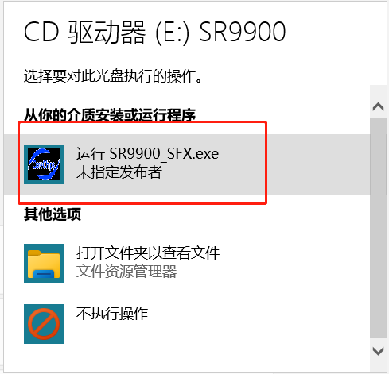
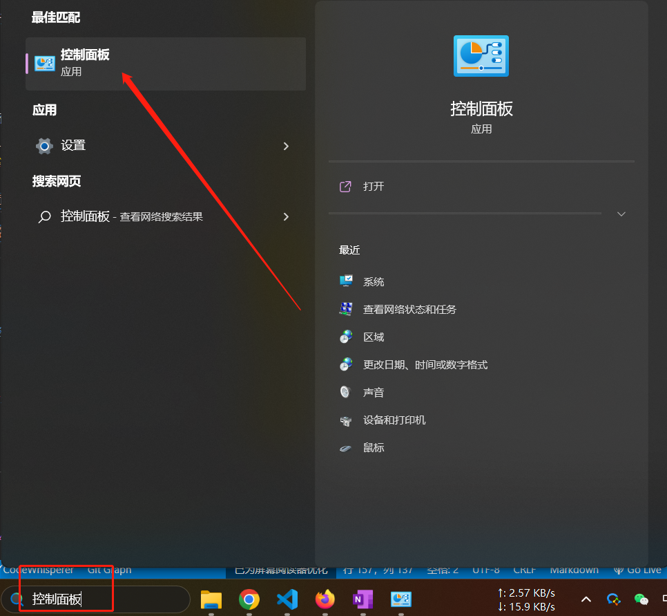
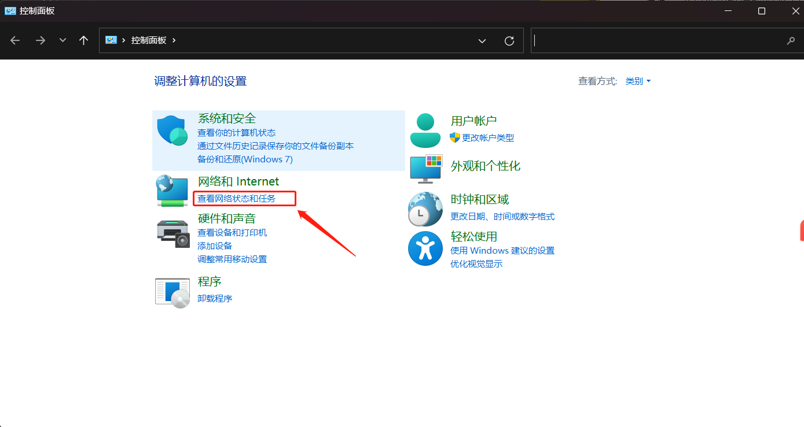
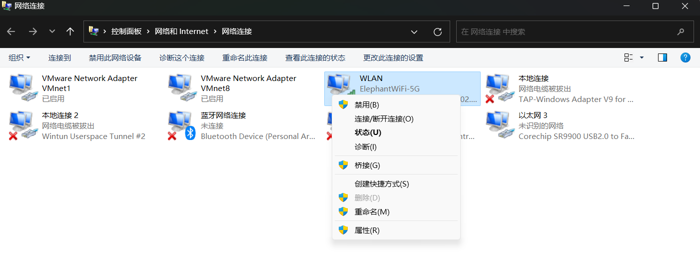
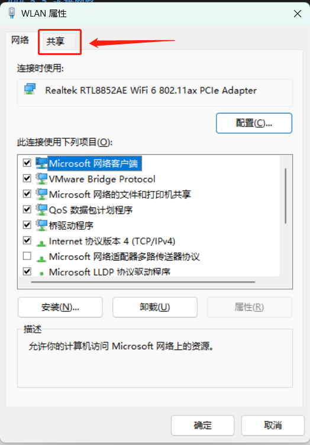
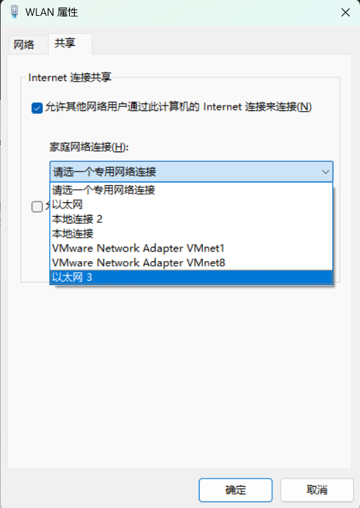
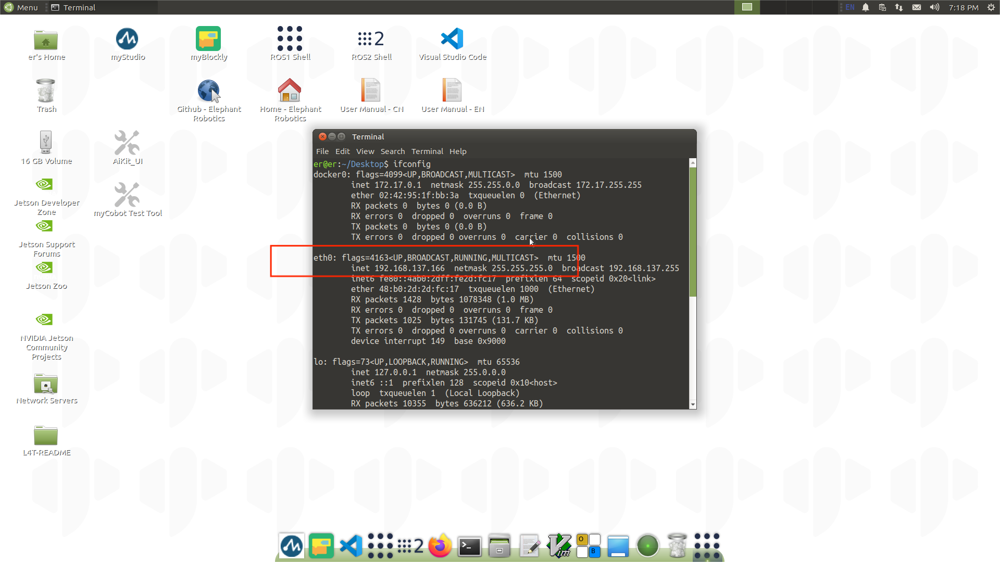
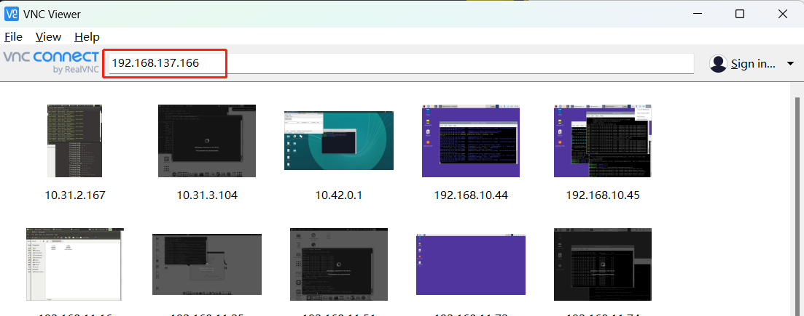
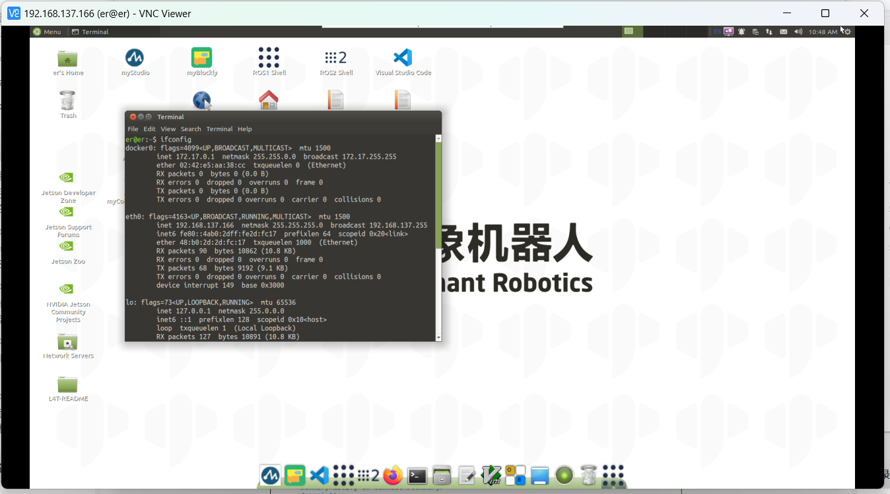
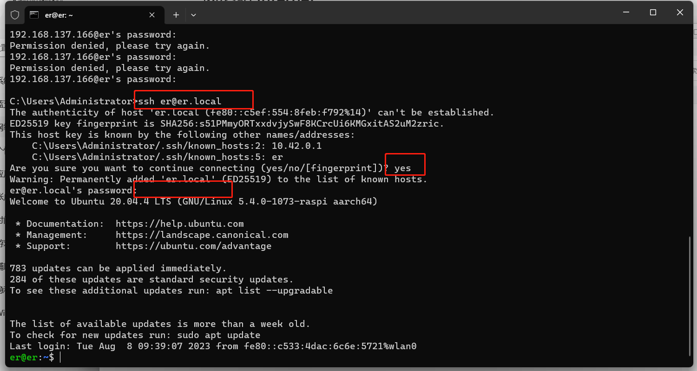

## Jetson nano版本机器人使用说明

### 1 机器人入门

### 1.1 机器人设备说明

- **支持的设备型号**
  
  - myCobot280 Jetson nano
  
  
- **Jetson nano 型号设备功能简述**
  
  - Jetson nano版本机器是大象机器人和**英伟达**官方联名产品，机械臂采用[**Jetson nano**](https://developer.nvidia.com/embedded/learn/jetson-nano-2gb-devkit-user-guide#id-.JetsonNano2GBDeveloperKitUserGuidevbatuu_v1.0-Introduction) 核心处理器，为应对客户**Linux**系统应用的需求，以及一体式集成机器人开发便捷的设备的需求而设计，产品保留了Jetson nano 的原生硬件接口，同时设备内置 **Ubuntu 20.04** 操作系统， **python ROS myBlockly** 等多种开发环境，
  
  - Jetson nano版本机器内嵌Jetson nano，1.43GHz 4核微处理器，运行Debian/Ubuntu平台，支持3路USB，1路HDMI，标准化GPIO接口 TF卡可插拔
  

- **Jetson nano 型号机器人就是电脑主机**

  - Jetson nano版本机器的本质是带有独立系统的开发板，是可以看做一个微型的电脑主机，主机和主机之间无法简单的通过一根线构成通讯。它只能连接到一台独立显示器上，并搭配电源 鼠标 键盘，进入到开发板内置的系统后对其进行开发和操作

  

### 1.2 开始使用你的设备

- **连接外部设备**
  
  - Jetson nano版本机器无需搭配PC、笔记本等设备，连接显示器即可进行应用开发（**提示⚠：请使用配套发货的HDMI线连接显示器，使用内置系统进行开发**）
  
  - 先将HDMI线插入显示器的HDMI接口

  <div align=center>
  
  </div>

  - 再将另一头插入机械臂的HDMI接口即可

  <div align=center>
  
  </div>

  - myCobot 280 Jetson Nano 有3路USB接口，这可以直接插入鼠标、键盘和其他外围设备使用
  <div align=center>
  
  </div>

  - 连接所需的外部设备后,按下按钮如图来启动机器
    <div align=center>
    
    </div>


[>>> 开箱视频](https://www.elephantrobotics.com/wp-content/uploads/2022/03/280jn%E5%BC%80%E7%AE%B1%E4%B8%AD%E6%96%8720220314_4.mp4#t=4)
- **系统卡说明**
  
  - 出厂自带64G TF卡，内置Ubuntu20.04 系统，已安装**myStudio 固件烧录软件**，**myBlockly 图形化编程软件**，且已适配**python 、ROS**开发环境


- **故障排除**
  
  - 确保你使用的是质量好的电源，我们建议使用官方提供电源

  - 在关闭机械臂之前，请确保正确关闭了操作系统

  - 您可以在我们的gitbook上获得有关使用机械臂的帮助
  
  
### 1.3 操作系统的更新升级

- **烧录系统镜像到系统卡**
  
  - 具体烧录步骤可查看此[章节](../../19-mirroring/镜像与烧录/15.2-mirroring-burning.md)
  
  
- **下载系统补丁包**
  
  - 开发中，敬请期待
  
  
- **故障排除**
  
  
## 2 操作系统说明

### 2.1 机器人系统介绍

- **系统简介**
  
  - Ubuntu是个人桌面操作系统中使用最广泛的linux操作系统。对于初学者来说，熟悉linux环境或一些嵌入式硬件操作系统是一个很好的选择。

    

- **系统功能简介**
  
  - **myStudio**：固件烧录软件，用于更新和烧录新版本固件  
  
  - **myBlockly**：图形化编程软件，可直接通过拖拽积木组成运行代码，控制机械臂  
  
  - **ROS1 Shell**：直接进入编译好的ROS1环境，可直接输入对应指令，运行对应的ROS1代
    
  - **ROS2 Shell**：直接进入编译好的ROS2环境，可直接输入对应指令，运行对应的可直接运行ROS2代码  
  
  - **Github-ElephantRobotics**：大象机器人官方开源代码仓库  
  
  - **Home-ElephantRobotics**：大象机器人官网主页  
  
  - **UserManual - CN/EN**：机器使用手册，包含所有关于机械臂控制的内容  
  
  - **Language Support**：系统语言设置，点击即可进入系统语言设置界面

### 2.2 系统密码说明

- **开机账户密码 & VNC 连接密码 & SSH 连接密码 & 管理员账户密码**
  
  - 统一为：**Elephant**
  
  
- **如何定义新的密码**
  
  - 更改账户密码
  
    - 使用快捷键 `ctrl + alt + T` 打开终端
    
    - 输入 `passwd`进行账户密码修改
    
    - 输入新密码两次即可
    
    
  - 更改VNC连接密码
  
    - 使用快捷键 `ctrl + alt + T` 打开终端
    
    - 输入 `vncpasswd`进行账户密码修改
    
    - 输入新密码两次即可
    
    
  - 更改SSH连接密码
  
    - SSH远程连接输入的就是管理员账户密码，无需单独修改
    
    
  - 更改管理员账户密码
  
    - 使用快捷键 `ctrl + alt + T` 打开终端
    
    - 输入 `sudo passwd`进行账户密码修改
    
    - 输入新密码两次即可
    
### 2.3 连接网络

Jetson nano版本机械臂仅支持有线网络连接，下面介绍PC通过网线共享网络的连接方式：
  - 1.需要准备一根网线和带有网口的USB扩展坞
    
  - 2.将网线一段连接到机械臂的网口，另一端连接拓展坞的网卡，将拓展坞的USB接口连接PC。
    - 初次连接PC会以驱动器的形式出现，需要新安装驱动才能识别到机械臂的以太网。桌面右下角会出现如下图提示：
        
        点击该提示会打开如下图界面，点击运行：
        
        运行完成以后，PC就可以识别到机械臂的以太网了。

  - 3.PC通过搜索栏搜索`控制面板`，打开控制面板选择`查看网络状态和任务`再点击`更改适配器设置`选中PC连接的网络，右击点击`属性`再选择`共享`，勾选`允许其他网络用户通过此计算机的Internet连接来连接`，并且选择机械臂的`以太网`（有的电脑没有此选项，不选即可），点击`确定`退出。
  
  
  - 3.完成上述步骤以后，机械臂系统，通过快捷键`ctrl`+`alt`+`t`，打开终端，输入`ifconfig`后回车，出现`eth0`就表示联网成功了：
    

### 2.4 VNC

***使用VNC的前提是机械臂已经连接上了网络，并且PC端需要安装[VNC viewer](https://vnc-viewer.en.softonic.com/)软件***

- **VNC 功能介绍**
  
  - 是一款远程控制的软件，一般用于远程解决电脑故障或软件调试
  
  
- **VNC端口说明**
  
  - 机械臂与PC连接在同一WiFi下或者通过网线共享网络给机械臂，机械臂IP地址即为端口
  
  
- **连接VNC**
  - 通过网线连接网络以后，通过快捷键`ctrl`+`alt`+`t`，打开终端，输入`ifconfig`后回车，可以获得机械臂的网络IP地址：
    
  - PC端打开VNC viewer软件，输入机械臂的IP地址，按回即可
    
    
  - 
  
  
  
### 2.5 SSH

- **SSH 功能介绍**  
  
  - 简单说，SSH是一种网络协议，用于计算机之间的加密登录。如果一个用户从本地计算机，使用SSH协议登录另一台远程计算机，我们就可以认为，这种登录是安全的，即使被中途截获，密码也不会泄露。
  
  
- **SSH端口说明**
  
  - 默认端口22，无需更改    
  
  
- **SSH 首次连接**
    
  - 在个人电脑按下 `win + R` 打开运行界面，在输入框输入 `cmd`
    
  - 输入完毕后点击确认，即可打开shell界面
    
  - 输入 `ssh er@er.local` ，然后回车.
  - 出现如下提示，输入`yes`回车
    
  - 再输入密码 `Elephant`，输入的密码不会显示出来，正常输入即可。
如上图所示，已成功远程ssh连接

### 2.6 语言配置

- **如何切换语言**
  
  点击桌面**Language Support**进入语言切换界面，拖拽想要更换的语言到最上方，重启系统即可
  
  
  
  
- **如何下载语言**
  

  点击桌面**Language Support**进入语言切换界面，选择语言，点击下载，输入密码**Elephant**
  
  

### 2.7 python

- **机器人系统python简介**
  
  系统内置安装**Python3.8** ，无需自行安装
  
  已安装Python依赖：
  
  
  | Package | Version|
  | :------: | :------: |
  | pymycobot | 3.1.6 |
  | pyserial | 3.5 |
  | numpy | 1.23.5|
  | opencv-contrib-python | 4.7.0.72|
  | rospkg | 1.4.0 |
  | rospkg-modules | 1.4.0 |
  
  
- **初次使用python**
  

  初次接触python编程语言，可跟随以下视频进行编程
  
  <video id="my-video" class="video-js" controls preload="auto" width="100%"
  poster="" data-setup='{"aspectRatio":"16:9"}'>
    <source src="../../resourse/2-serialproduct/2.1-280/Pi/2.1.5.4/python-terminal.mp4" type='video/mp4' >
  </video>
  
  <video id="my-video" class="video-js" controls preload="auto" width="100%"
  poster="" data-setup='{"aspectRatio":"16:9"}'>
    <source src="../../resourse/2-serialproduct/2.1-280/Pi/2.1.5.4/python-program.mp4" type='video/mp4' >
  </video>
  
  
  
  
  可在输入框中尝试此代码：
  
  ```eval-python
    
    print ("Hello World!")
    
  ```


- **运行机器人案例代码**
  
  具体案例代码可查看[Python章节](../../7-ApplicationBasePython/README.md)，直接将案例中代码复制下来即可使用
  
- **对应章节案例**  
  
  [1 关节控制](../../7-ApplicationBasePython/7.3_angle.md)
  
  [2 坐标控制](../../7-ApplicationBasePython/7.4_coord.md)
  
  [3 IO控制](../../7-ApplicationBasePython/7.5_IO.md)
  
  [4 夹爪控制](../.7-ApplicationBasePython/7.6_gripper.md)
  
  [5 TCP/IP 连接](../../7-ApplicationBasePython/7.7_TCPIP.md)
  
  [6 蓝牙手柄控制](../../7-ApplicationBasePython/7.9_HandleControl.md)
  
  [7 案例及运行效果](../../7-ApplicationBasePython/7.8_example.md)
  
  