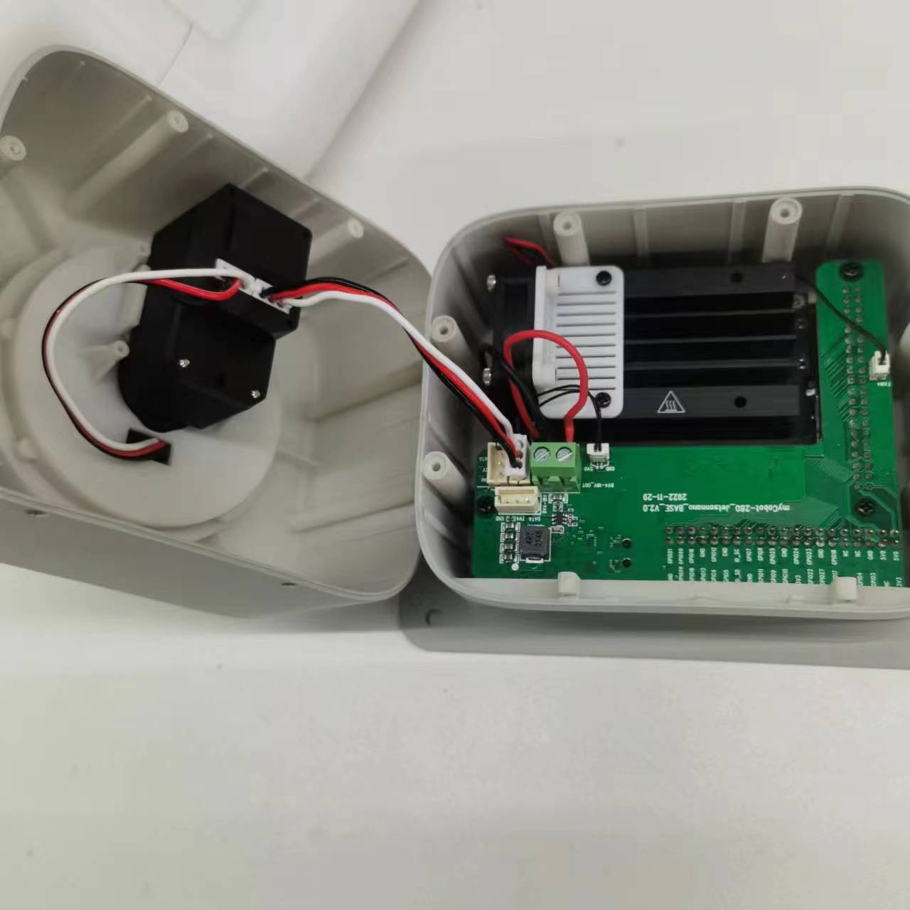
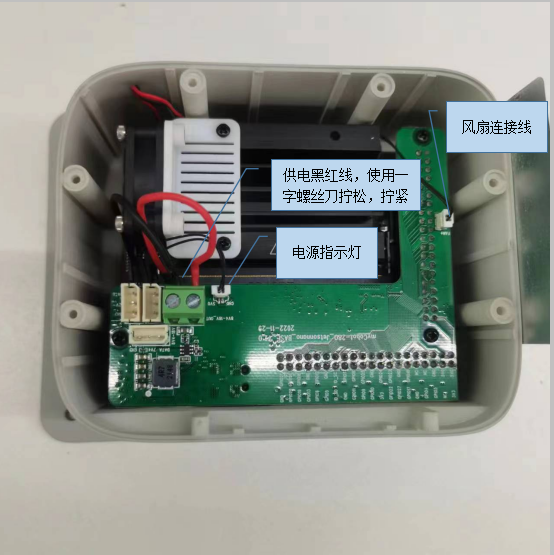
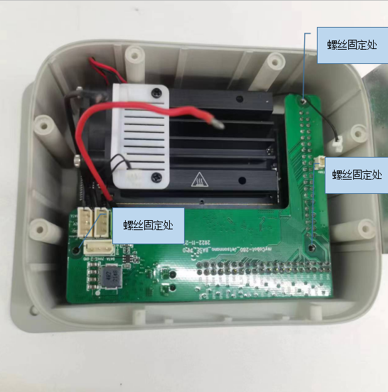
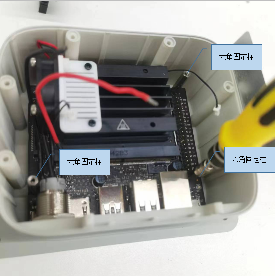
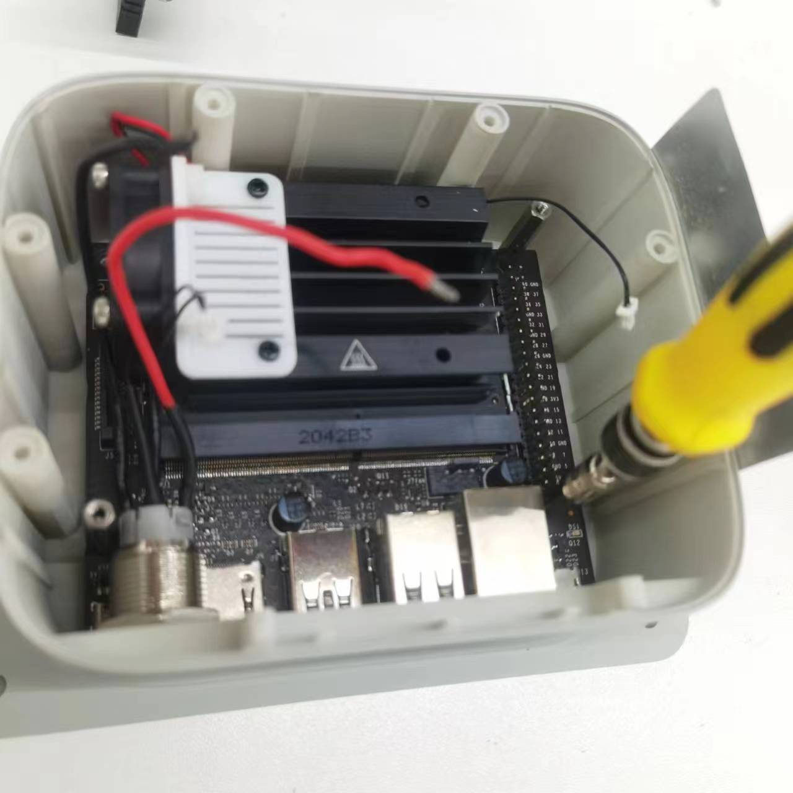

### ***myCobot 280 Jetson Nano***

### **更换TF卡教程**

设备底座正面展示图

 

  
  

- 第一步：查看确认TF卡槽位置，TF卡在设备内部，这里需要动手拆除底座下盖更换

  

  
  

- 第二步：取出正面的2颗固定螺丝，使用1.5十字螺丝刀

  
  

- 第三步：取出底部面的6颗2*8固定螺丝，使用1.5MM十字螺丝刀

  
  

- 第四步：拔开舵机（黑红白3PIN）连接线

  
  

- 第五步：需拔下风扇连接线，电源指示灯连接线，电源黑红线

  
  

- 第六步：取出图中绿色PCBA板，取出板上3颗固定螺丝

  
  

- 第七步：取出六角固定柱3颗

  
  

- 第八步：取出主控板（请注意防静电措施）

  
  

- 第九步：取出TF卡，或更换TF卡。 （请注意防静电措施）

  
  

  
  

- 第十步：装回主控板

  
  

- 第十一步：装配注意要点

  
  

- 第十二步：装配注意要点

  
  

  
  
