# 背景知识

了解myCobot，需要从硬件、软件、机器人算法，几个方面分别进行深入的了解。在此之前，可以通过了解机器人的历史来了解机器人的进展历程。

- [**机器人**](./3.1-series_robot.md)
- [**电子**](./3.2-electric_knowledge.md)
- [**电机**](./3.4-motors_and_servos.md)

## 制造变迁史：从手工到机器人
>作者 ：大象机器人

2019年，全球制造业遭遇了重大危机。

美国制造业指数PMI创近10年新低，中国制造业指数也大幅放缓。向前蓬勃发展30年的中美贸易，在贸易战的影响下受到重创。

自十八世纪中叶开启工业文明以来，世界强国的兴衰史和中华民族的奋斗史一再证明：“得制造业者得天下”。

特朗普打着“振兴美国制造业”的旗号成功竞选总统，尽管从未被实践；最近，美国前总统奥巴马监制的以中国企业福耀玻璃为原型的纪录片《美国工厂》喧嚣日上，矛头也直指制造业。有人说，这是奥巴马在作为总统时未曾实现的美国梦的一个延续：把当政客时没有讲完的话，讲全乎了。

2019年，全球制造业遭遇了重大危机。

美国制造业指数PMI创近10年新低，中国制造业指数也大幅放缓。向前蓬勃发展30年的中美贸易，在贸易战的影响下受到重创。

自十八世纪中叶开启工业文明以来，世界强国的兴衰史和中华民族的奋斗史一再证明：“得制造业者得天下”。

特朗普打着“振兴美国制造业”的旗号成功竞选总统，尽管从未被实践；最近，美国前总统奥巴马监制的以中国企业福耀玻璃为原型的纪录片《美国工厂》喧嚣日上，矛头也直指制造业。有人说，这是奥巴马在作为总统时未曾实现的美国梦的一个延续：把当政客时没有讲完的话，讲全乎了。

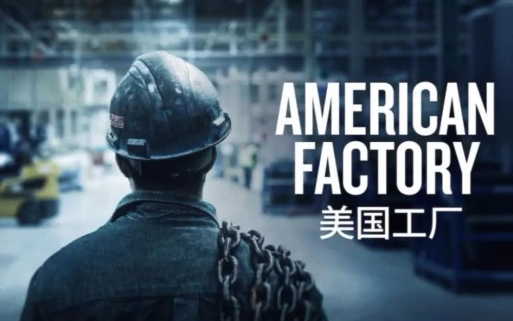

制造业逃离美国，转向中国是不争的事实。影片里的福耀背道而驰，坚持打造美国的工厂也仅是为了照顾美国本土汽车行业而做的不得已之举，对现如今的制造业流向趋势并无多大贡献。

从工业革命至今，全球制造业经历了四次大迁移，制造业的重心，从英国，欧洲转向美国、日本，再到中国。目前全球制造业第五次迁移正在进行中，新一轮的制造中心开始流向东南亚的越南、印尼、印度等国家。

中国特色社会主义经济道路也难逃制造业的发展定律。随着我国人口红利的消失，传统制造业依靠人力发展的道路越走越窄。与此同时，以工业机器人为代表的智能装备，正为传统的装备制造以及物流等相关行业的生产方式带来了革命性的产业变革。

这样的转变，在关于制造的历史长河中也许仅是一个小小的片段。但对国家来说，每一次的改革创新，都是洪流下的巨变。

电影《2001：太空漫游》的一开始，一个史前猿人因为受到了黑石方碑的影响，学会了将骨头作为武器猎杀其他动物。与之相呼应的片尾，他将骨头抛入高空中，画面一转，诞生了一艘太空飞船。

从远古时代的石器到迄今尚在探索的宇宙飞船，这其中跨越260万年历史的变化发展，流淌的是整个人类文明制造发展史。

现如今我们所在的世界，眼之所在，皆是人类的发明制造；但这只是比较宽泛广义上的制造。真正意义的制造业，是机械工业时代对制造资源（物料、能源、设备、工具、资金、技术、信息和人力等），按照市场要求，通过制造过程，转化为可供人们使用和利用的大型工具、工业品与生活消费产品的行业。 

**01. 黎明前的摸索**

远古时期，世界的主体经济仍以游牧文明与农耕文明为主，制造业的胚芽尚在孕育当中。早期的制造是以制造工具更新换代的形式存在发展的。

迄今为止，最早被发现的石器工具是在肯尼亚发掘出来的，距今已有约260万年的历史。最原始的工具雏形出现在旧石器时代，工具形状大小各异，主要呈块状、薄片状和刀片状等。

同样是在肯尼亚，1981年，根据发掘的证据，人类控制火源的历史可以追溯到142万年前。

使用工具和能源，被认为是人类区别于其他物种的主要因素之一。在这个基础上，人类各种奇思妙想迸发，属于人类的文明生活就此拉开帷幕。

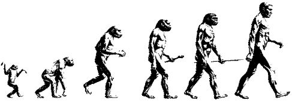

人类定居下来后科技发展的步伐大大加快，金属的出现成为人类科技文明发展的一次重大飞跃。

人类真正掌握铸造技术则是源于古埃及人发明的熔模铸造技术，这项技术通过向模型中注入熔化的金属，排出融化蜂蜡而成型。后来古埃及人还发明了金属锯，用以快速锯开木质的材料。

中国人则认为锯是鲁班在公元前5世纪发明。但中国人的确在公元前400年发明了高炉，用以炼制青铜。由其演变而来的炼铁工业制造了数以百万计的武器与衣物，成为秦始皇统一中国必不可少的工具。

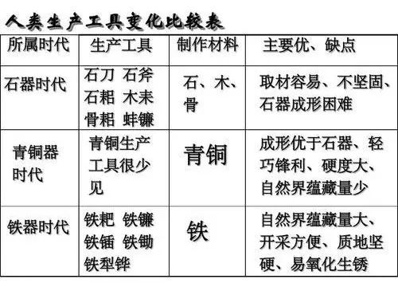

制造工具的推陈出新，得益于制作材料与工艺技术不断的发展创新。但提高制造效率的途径不仅仅是提高工艺与材料。

在工业革命开始前的600多年，威尼斯人首创了大规模生产模式——经过专业化的分工，将从事不同工种的劳动力分散在一条生产线上。生产线的诞生，大大提升了生产率和产量，实现了高品质武器的大规模生产。

这也意味着制造不再局限于制造材料与工艺技术，还包括了制造系统。与此同时，制造条件基本形成。

但在工业革命前的数千年间，在人们对能源与工具的使用无法进行指数型提升的背景下，现代人类重复的陷入马尔萨斯陷阱：人口增长超越食物供应，会导致人均占有食物的减少，最终弱者就会因此而饿死。

无休止的重复仿佛魔咒般无法逃离，黎明前的黑暗让人窒息，直到工业革命的来临。

**02. “蒸汽朋克”的匠心**

为了快速煮饭以及保留骨头的丰富营养和松软的口感，高压锅在1679年由法国科学家班平发明。高压锅的发明让他发现了一个有趣的现象：大气压力会影响沸点，蒸汽的力量可以抬起锅盖。

1698年，塞维利从班平的设计中得到灵感发明了抽水泵——一种最基本的蒸汽机，可以利用蒸汽动力缓解矿井排水问题。14年后的1712年，纽科门解决了塞维利抽水泵的距离缺陷，双方合作发明了常压蒸汽机。

尽管常压蒸汽机气体冷凝速度慢，无法使蒸汽行程的活塞运动连续产生，效率较低；但由于焦炭冶铁技术的出现导致煤炭的需求急剧上升，它仍然受到了人们的热烈追捧。

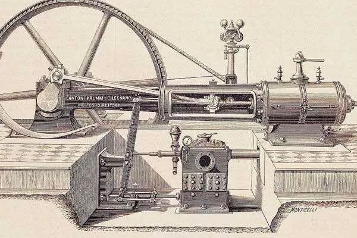

常压蒸汽机

与此同时，“珍妮纺纱机”的出现首先在棉纺织业中引发了发明机器、革新技术的连锁反应，揭开了工业革命的序幕。

命运的转折点发生在1785年。瓦特发明了第一台带独立冷凝器的蒸汽机，体积小，耐久度高，可以持续、高效率的产生活塞运动从而提供旋转式的动能。改良型蒸汽机的投入使用极大推动了机器的普及和发展，人类社会由此进入“蒸汽时代”。

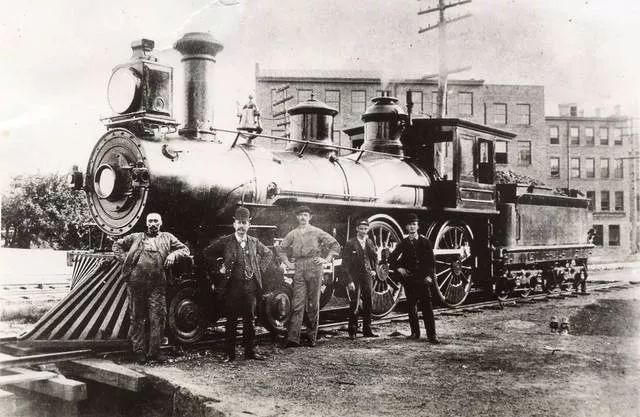

工业革命带来的科技创新以多种形式对制造产生着重大的影响。

工业生产中机器生产逐渐取代手工操作，一种新型的生产组织形式——工厂出现了。经济社会从农业、手工业为基础转型到了以工业及机械制造带动经济发展的模式，制造企业的模型初见端倪；企业形成作坊式的管理模式。

1776年3月，亚当·斯密的《国富论》中第一次提出将制造分解成若干具体的任务，将任务交由不同的人进行处理的生产，即“劳动分工”的科学定义。因为劳动分工对提高劳动生产率和增进国民财富的巨大作用，后来分工论逐渐演变成为企业管理的主要模式。

除此之外，在制造系统方面，1797年，惠特尼（Whitney）谈判达成了为美国政府生产10,000支步枪的合同，“可互换零件”与“配合装配”概念也因此在美国大批量传播推广。

依靠工业革命完成的资本积累，社会结构也发生重大变革；新兴城市的产生以及世界工业化的进程都为制造业的蓬勃发展提供了肥沃的生长环境。

但此时的制造业还只是初具雏形，因为科学和技术尚只是在局部发明创造，尚未在制造业中真正结合起来，而相关的制造系统的概念也只是初步形成理论，没有经受实践的检验。

**03. “电光火石”一触即发**

当制造业不再局限在小型家庭作坊式的工厂，而是成长为大规模生产的工厂时，先进的生产技术和生产关系的重大变革起到了决定性作用，而这其中的关键在于科技与创新的发展。

第二次工业革命爆发期间，科学技术的复杂性和先进性达到了新的高度——自然科学同工业生产紧密结合起来。新的技术和发明远超过一国的范围，规模更加广泛，人们开始更多地尝试以前无法完成的大型设备。

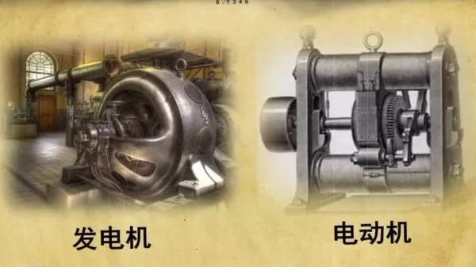

其中电力的广泛应用、内燃机和新交通工具的创制、新通讯手段的发明成为了当时科学技术最为突出的代表，制造业的发展一日千里。

兰索姆奥兹为了大批量生产汽车，发明了一个革新整个汽车行业的发明——装配线，装配线的发明将汽车产量从1901年的425辆提升到了1902年的2500辆。直到1913年，福特在装配线的概念基础上开创了流水线，大批量生产的模式进一步提高了汽车产量，大大降低了生产成本。

泰勒的科学管理理念对制造中的每个环节进行了科学化、理性的定义，其中包括
- 工人的工作任务时间、节拍标准；
- 行业标准的广泛使用；
- 计件制与劳动激励；
- 工厂中的数据搜集，用以替换工人以及成本核算。

新概念、新模式的出现导致制造技术的过细化分工和制造系统的功能分解，逐步形成了以科学管理为核心，推行标准化、流程化的管理模式，企业的人与“工作”得以匹配。

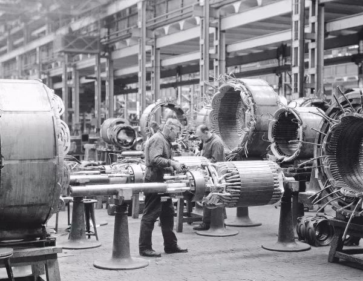

德国西门子生产车间

依靠工业革命蓬勃发展完成的资本积累，英法德美等国家率先进入现代化工业强国，形成西欧和北美两大工业地带。其中，重工业长足发展，逐步占据经济的主导地位。但当时整个世界的经济发展极其不均衡。

与此同时，制造业开始往劳动密集型产业和技术密集型产业两个方向分流。而这也成为当今全球制造经济四梯队的最初模型。
- 第一梯队：以美国为主导的全球科技创新中心；
- 第二梯队：高端制造领域，包括欧盟、日本；
- 第三梯队：中低端制造领域，主要是一些新兴国家，包括中国；
- 第四梯队：资源输出国，包括OPEC(石油输出国组织)、非洲、拉美等。

**04. 计算机：灵魂的起舞**

科技与创新始终是制造业发展与转型的关键所在。计算机的产生，给制造业注入了新的灵魂，制造业的发展取得了质的飞跃。

第一台数字式电子计算机于1941年由德国工程师康拉德楚泽发明。这是第一台全部由程序控制的计算机。
- 1963年，计算机辅助设计CAD开始允许用户使用一根“光电笔”对系统进行绘图。
- 1971年工作在雷诺公司的法国工程师贝塞尔发明了计算机辅助制造系统CAM，开始在电脑端与工厂机械设备之间建立虚拟联系，并实现控制。
- 1983年，康柏公司开发了第一台笔记本电脑。一体便携式的设计，尽可能简洁的IO设计大获成功。

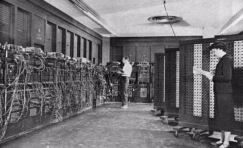

世界第一台计算机

PLC于1960年诞生于美国通用公司，与计算机类似的是，它们都由软件控制，以实现固定指令；但PLC的编程更加简单，使用更加方便。在此阶段，工厂大量采用由PC、PLC/单片机等真正电子、信息技术自动化控制的机械设备进行生产。

由于当时的计算机体积较大，微型计算机与微型控制器于1971年由英特尔公司的特德霍夫发明而成。最初是为集中功能不同的计算器，随后又发明了英特尔4004微处理器。

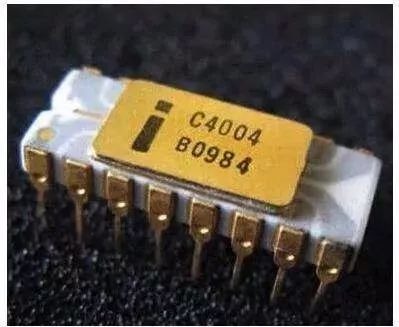

英特尔4004微处理器

微处理器的发展，极大程度地带动了各种制造工具的自动与智能化。自此，机器逐步替代人类作业，不仅接管了相当比例的“体力劳动”，还接管了一些“脑力劳动”。

制造工具也不单单是为工艺生产而服务的特种设备，更加通用、替代工人、服务于制造系统的制造工具应运而生。

机器人最早可追溯到1495年，奥纳多达芬奇制造了最早的机械骑士机器人；但现代第一台全自动机器人由美国神经学家沃特博士于1948年发明，这是一个类似于乌龟的小机器人，具有外部感光和触觉传感，在简单的电路帮助下可以自行运动。

直到20世纪50年代美国工程师乔治德沃尔与约瑟夫英格伯格提出了工业机器人，即工业机械臂的概念。在经历过若干样机试验后，英格伯格所在的Unimation公司生产了第一台名为Unimate的机械臂，该机械臂重达2吨，服务于通用汽车的装配线。当时仅实现将热压铸件在不同工位间的转移工作，随后几年开始进行车体的焊接工作。

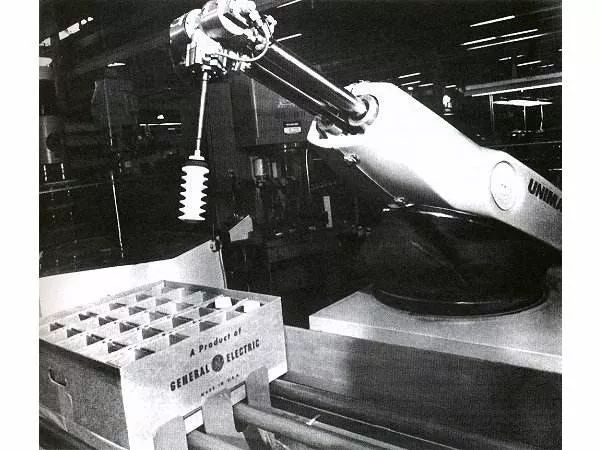

Unimate机器臂

在升级工业2.0的基础上，广泛应用电子与信息技术进一步大幅度提高了制造过程中自动化的控制程度，生产效率、良品率、分工合作、机械设备寿命也得到了前所未有的提高；生产组织形式从工场化转变为现代大工厂，人类进入了产能过剩时代。

由于各国资源禀赋不同，全球制造业发展开始联通，制造业逐渐形成产业链分工不同的全球化模式。但随着工业霸主国生产资料成本的上升，全球制造业自20世纪以来经历了多次迁移，加工制造中心不断发生转移。

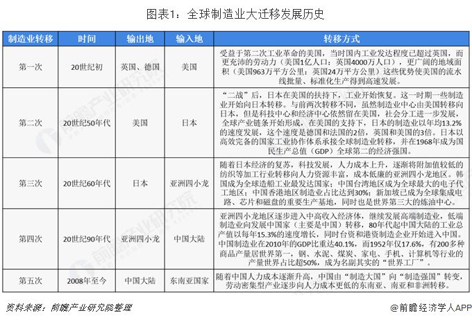

**05. 智能时代，未来已来**

人们常用最具代表性的生产工具来代表一个历史时期，如石器时代、青铜时代、铁器时代、蒸汽时代、电气时代、原子时代等；而21世纪最具代表性的生产工具非属互联网。

基于计算机的出现，因特网于1969年诞生。最初它还只是为了抵御前苏联的核威胁，快速传递信息与数据；到了1973年，为连接不同的计算机与计算设备，施乐公司开发了因特网，直到今日因特网仍在工厂的信息互联上承担重要角色；当然也远远不止如此。

互联网的协议（即TCP/IP），由罗伯特卡恩与文顿瑟夫发明，打通了电脑与电脑之间交流的最后一道坎；而极大扩大的互联网的容量与可能性将万物互联变为现实。

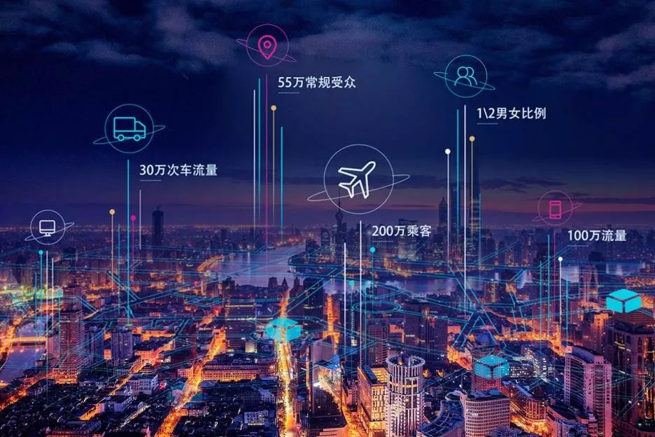

互联网、大数据、云计算、物联网等新技术与工业生产相结合，人类开始进入智能化时代。智能化时代下，制造业的生产组织形式从现代大工厂转变为虚实融合的工厂，柔性生产、个性化生产成为了时代的宠儿。

随着制造的智能化与互联化，机器人也有了长足的发展。

在2010年以前，大部分工业机器人都按照固定程序进行重复劳动，无法考虑到实际环境的变化，而且程序编写复杂，普通人无法使用。

1996年，由利诺州西北大学的教授J.Edward Colgate和Michael Peshkin提出的协作机器人概念，即机器人可以感知周围环境变化，更易使用与交互。

2008年，丹麦公司发明了第一台协作机器人UR5，可以实现碰撞停止，图形化编程等功能，实现了协作机器人的普及。

GGII数据显示，自2008 年以来，协作机器人行业从萌芽期进入快速发展期；截至2019年7月，全球协作机器人厂商数量己超过100家，其中进入中国市场的协作机器人厂商数量超过70家，“协作机器人”己经从概念到深入人心，并逐渐成为各机器人厂商争相布局的战略产品。

得益于其拥有较高的柔性、安全性和易操作性，协作机器人相较于传统工业机器人具有更广的应用延展性，不仅可以在工业领域应用，还可以在商业服务领域应用。

**大象机器人Elephant Robotics** 

2019年，大象机器人开发了首款便携式的协作机器人Catbot；更轻便易用的设计以及欧美亚洲数十个国家的实例应用更加广泛地扩展协作机器人在更多领域发展的可能性。

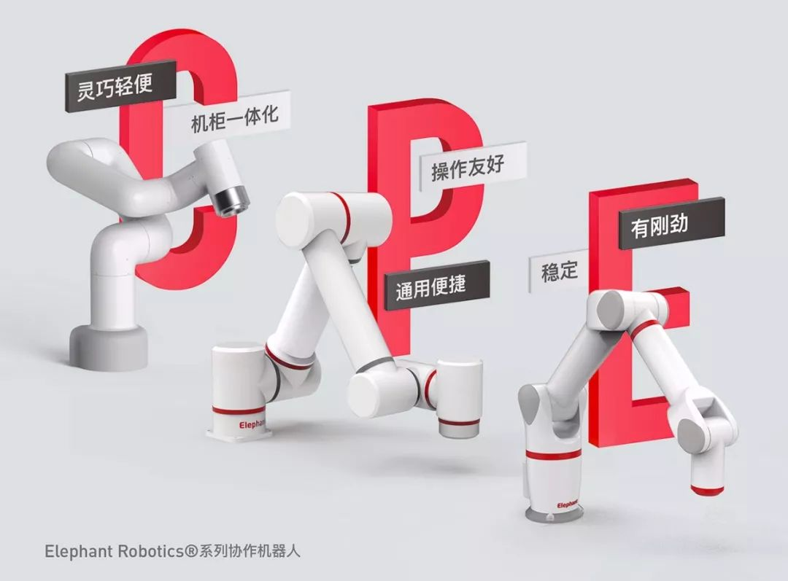

古典经济学的奠基人亚当·斯密曾说过，"一切生产的最终目的都是满足人的需求"，智能化时代让人类重新认识世界、认识自己。

但智能制造的实现需要多个层次上技术产品的支持，其中包括工业机器人、3D打印、工业物联网、云计算、工业大数据、知识工作自动化、工业网络安全、虚拟现实和人工智能等。而这些技术产品中会产生无数的商机和上市公司。

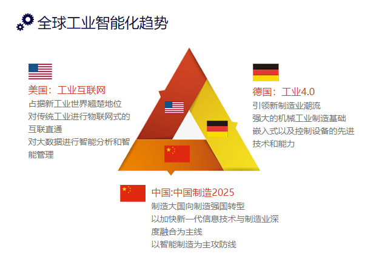

“在历次的技术革命中，一个人、一家企业、甚至一个国家，可以选择的道路只有两条；要么加入浪潮，成为前2%的人，要么观望徘徊，被淘汰。”

智能制造站在全球范围内制造业发展趋势的风口，将带来新一轮生产方式、产业形态和商业模式之间的较量。发展企业智能制造依然成为必然的要求和趋势。

英国狄更斯在《双城记》曾说，“这是最好的时代，也是最坏的时代”。这句话不仅适用于第二次工业革命，也适用当下，这个正在发生重大变革的时代。

科学技术的发展深不可测，未来的制造业的发展我们尚不得知。在历史的洪流下，我们唯一做的，就是顺应时代的发展，在这场接力赛中，跑好属于自己的那一棒。

---
[← 上一页](../14-IssueFAQ/14.3-hardware.md) | [下一页 → ](./3.1-series_robot.md)