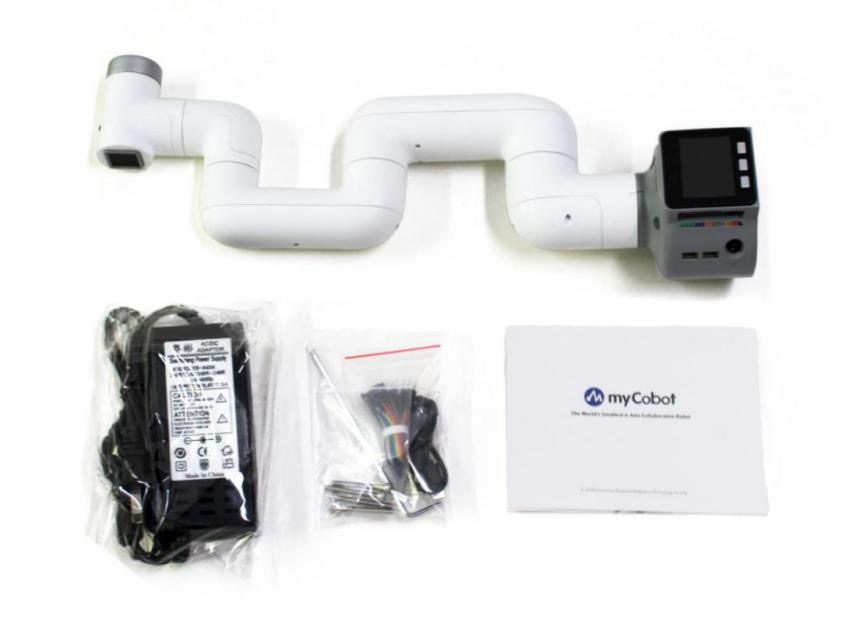
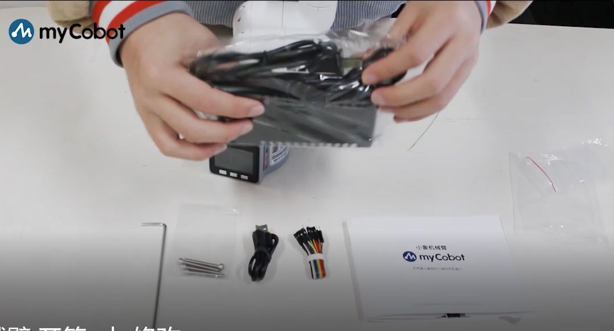
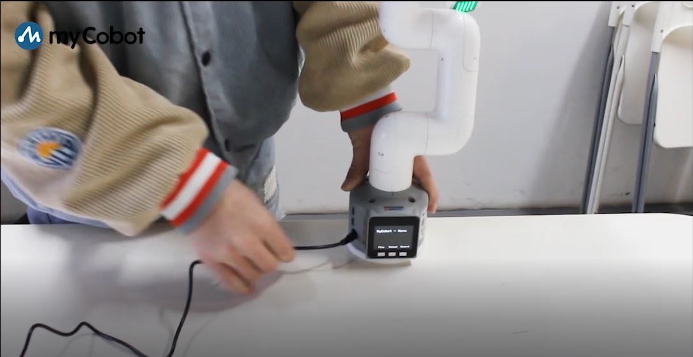
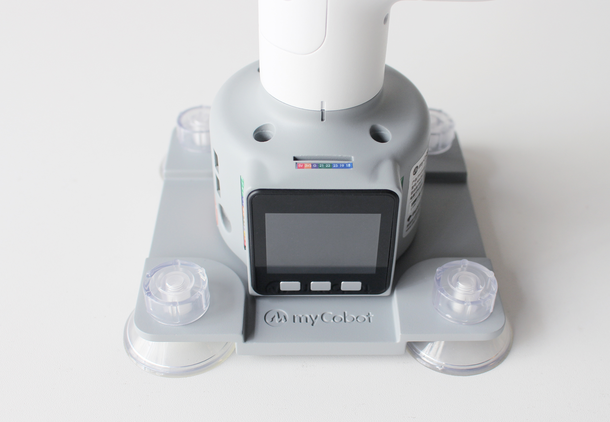
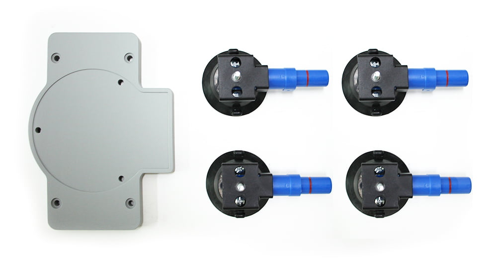
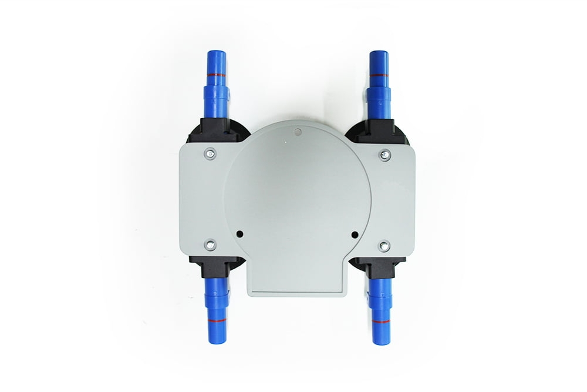

# 首次使用

## Step 1: 开箱

包装箱到位后，请先确认机器人包装完好无损，**如有丢失或破损请及时与物流公司及所在地区的供应商联系。**拆封后，请根据物品清单对箱内实际物品进行核对。

**1 myCobot机械臂【标准套】所含产品内容**

+ myCobot机械臂（型号myCobot-280）
+ myCobot机械臂-产品画册
+ myCobot机械臂-配套电源
+ USB-Type C
+ 跳线
+ M4*35，杯头内六角，全螺纹，不锈钢螺丝
+ 内六角扳手

**2 确认工作环境与指标**

请将机器人系统设置在符合如表所述条件的环境中，以便发挥、维持本机的性能并安全地进行使用。

|环境   |指标  |
| : ---- :| :----  :|
|温度	|-10℃~45℃|
|相对湿度	|20%~70%|
|室内外要求	|室内|
|其他环境要求	|避免阳光照射。 远离灰尘、油烟、盐分、铁屑等。 远离易燃性、腐蚀性液体与气体。 不得与水接触。 不传递冲击与振动等。 远离强电磁干扰源|

## Step 2: 连接

如图所示，连接电源适配器：

连接电脑：

## Step 3: 电源

myCobot**必须使用外部电源**进行供电，以提供足够的电量：
- **额定电压**：7-9V
- **额定电流**：3-5A
- **插头类型**：DC 5.5mm x 2.1

注意，**不能仅仅使用插入M5Stack-basic的TypeC进行供电**。

使用官方适配的电源，以免对机械臂造成损害。

## Step 4: 固定

**1 如何固定 myCobot**

在 **机械臂** 的运动过程中，如果不将 myCobot 的**底面与桌面或其他底面相连**，仍然会造成 myCobot 的 **摇晃或倾覆**。

常见的固定机械臂的方式有三种：

- 1) 使用**乐高插键**固定在具有乐高接口的底座上 
     我们销售的底座有 2 种：平面吸盘底座与 G 型夹底座，可以在 [myCobot 周边底座](https://docs.elephantrobotics.com/docs/acc-cn/2-serialproduct/2.7-accessories/2.7.1%20pedestal/2.7.1.1-fsta.html)找到
     
     - 平面底座
       **适配型号**：myCobot 280
     
     
     
       - 在底座的四角安装吸盘并拧紧。
     
       - 用附带的乐高科技件，连接平面底座和机械臂底部。
     
       - 将四个吸盘固定在平整光滑平面后方可开始使用。
     
       **技巧：** 可以适当在吸盘下加入少量**不导电**液体，以填补吸盘与桌面的缝隙，以获得最佳吸附效果。
     
              
     
     - G型底座
       **适配型号**：myCobot 280、myPalletizer 260
       
     
     
     
       - 用G形夹将底座固定在桌子边沿
     
       - 用附带的乐高科技件，连接底座和机械臂底部
     
       - 确定稳固后方可开始使用
     
      
  
- 2) 使用**自带螺丝**穿过 **机械臂** 底座，固定在有螺纹的底座上 
     - 吸盘底座
     **适配型号**：myCobot 320
     
     
     
     **适用平整光滑表面**  
     
       - 首先将自吸泵吸盘拆开，将底座底盘四个孔对准自吸泵吸盘放好，将螺母放在四个孔位并拧紧，固定好底座底盘和自吸泵吸盘。
     
       - 将自吸泵吸盘底部的盖子拆开，放置在一个光滑的桌面上，按压自吸泵吸盘即可进行抽气。将四个自吸泵吸盘都抽气后，可以测试一下底座底盘是否已经固定好，可再次拧紧螺母进行加固。
     
       - 接下来将机械臂固定到底座底盘上，将机械臂对准底座底盘的凹槽，放置好后，将三个M6x90的螺丝放置在机械臂的三个孔位中，对应的将螺母放置在相同位置的底座底盘上，使用内六角扳手将螺丝拧紧，即可将机械臂固定在底座底盘上。
         

**2 myCobot 底座的螺丝孔位连接**

需要将机器人固定在牢固机座上才可以正常使用。机座重量要求：固定式机座，或移动式机座。

请确定固定底座上有对应螺纹孔位，再进行安装。

正式进行安装前，请确认：

- 待安装环境符合以上《工作环境与条件》表格的要求。
- 安装位置不小于机器人工作范围，且留有足够大的安装、使用、维护、维修的空间。
- 将机座放置到合适位置。
- 安装相关工具已准备好，如螺丝、扳手等。

**确认以上内容后**，请将机器人搬运至机座安装台面上，调整机器人位置，将机器人基座固定孔位与机座安装台面上的孔位对准。对准孔位后，将螺丝对准孔位，拧紧即可。

**注意**：在机座安装台面上调整机器人位置时，请尽量避免在机座安装台面上直接推拉机器人，以免产生划痕。人工移动机器人时请尽量避免对机器人本体脆弱部分施加外力，以免造成机器人不必要的损伤。

## 视频教程
[**myCobot快速开箱**](https://www.bilibili.com/video/BV1To4y1f71P/)
[**myCobot Pro 快速开箱**](https://www.bilibili.com/video/BV1bL411p7dY/)

