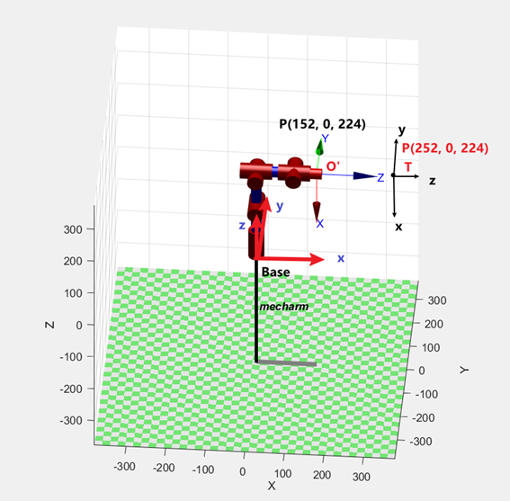

# myCobot 280 algorithm

## 1 结构参数

### 1.1 机械臂DH参数

| joint | theta |   d   |   a   | alpha | offset |
| :---- | :---- | :---- | :---- | :---- | :----  |
| 1 | q1 |   131.22   |   0   | 1.5708 | 0 |
| 2 | q2 |   0   |   -110.4   | 0 | -1.5708 |
| 3 | q3 |   0   |   -96   | 0 | 0 |
| 4 | q4 |   63.4   |   0   | 1.5708 | -1.5708 |
| 5 | q5 |   75.05   |   0   | -1.5708 | 1.5708 |
| 6 | q6 |   45.6   |   0   | 0 | 0 |

### 1.2 运动学模型

## 2 坐标系简介
### 2.1 工具坐标系

如图是Mecharm的机器人模型，图中的Base表示机器人的基坐标系，O’表示末端法兰盘坐标系，P点表示机械臂末端相对于基坐标系的位置（x=152, y=0, z=224）

在末端法兰盘的基础上延伸一定位姿，并将设置的工具点视为机器末端

图中的T即为设置的工具坐标系，该坐标系的姿态与O’一致，原点位置发生了相对位移，使用python函数设置工具坐标系

- set_tool_reference([x, y, z, rx, ry, rz])	//设置工具坐标系
- set_end_type(1)	//设置末端坐标系类型为工具
- 由于工具坐标系T相对O’未发生旋转，rx = ry = rz = 0
- 假设工具坐标系T的原点在坐标系O’中坐标为（x = 0, y = 0, z = 100mm）
- 最终的工具坐标系参数为set_tool_reference(0, 0, 100, 0, 0, 0)

由于设置了工具坐标系，此时机器人的末端从O’延伸至了T，此时读到的机器末端坐标变成了（152+100, 0, 224），并且坐标姿态运动将绕工具点T旋转。

### 2.2 世界坐标系

第2节介绍了通过设置工具坐标系可以对机械臂末端坐标系做一定位姿的延伸，我们也可以通过设置世界坐标系在机械臂Base基坐标系的基础上延伸一定位姿，设置的世界坐标系将取代原Base坐标系成为新的基坐标系。

图中的W即为设置的世界坐标系，该坐标系的姿态与Base一致，原点位置发生了相对位移，使用python函数设置世界坐标系

- set_world_reference([x, y, z, rx, ry, rz])	//设置世界坐标系
- set_reference_frame(1)	//设置基坐标系类型为世界
- 假设世界坐标系W相对Base未发生旋转，rx = ry = rz = 0
- 假设世界坐标系W的原点在坐标系Base中坐标为（x = 0, y = 0, z = -100mm）
- 最终的世界坐标系参数为set_world_reference(0, 0, -100, 0, 0, 0)

 由于设置了世界坐标系，此时机器人的原点从Base延伸至了W，此时读到的O’坐标变成了（152, 0, 224+100）。

---
[← 上一页](./3-RobotKnowledge/3.4-motors_and_servos.md) | [下一页 → ](./4-BasicApplication/README.md)
