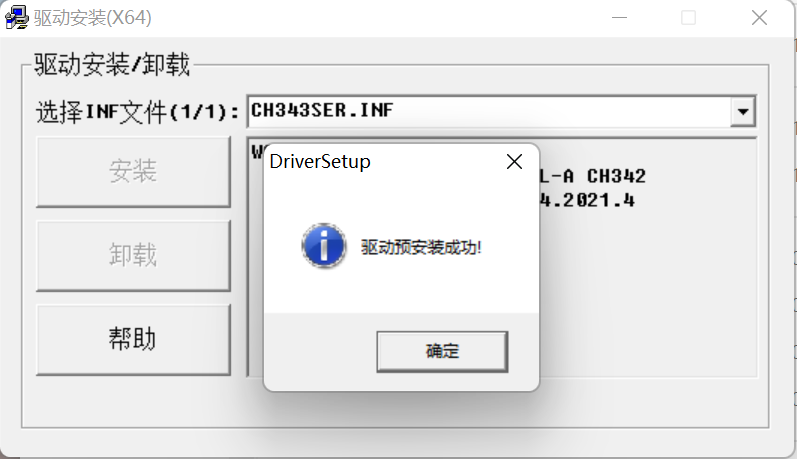

# **UltraArm_P340_Sorting_Kit_docs**


# 1 Equipment List
| Device name &nbsp;&nbsp;&nbsp;&nbsp;&nbsp;&nbsp;&nbsp;&nbsp;&nbsp;&nbsp;&nbsp;&nbsp;&nbsp;&nbsp;&nbsp;&nbsp;&nbsp;&nbsp;&nbsp;&nbsp;&nbsp;&nbsp;&nbsp;&nbsp;&nbsp;&nbsp;&nbsp;&nbsp;&nbsp;&nbsp;&nbsp;&nbsp;  |  quantity &nbsp;&nbsp;&nbsp;&nbsp;&nbsp;&nbsp;&nbsp;&nbsp;&nbsp;&nbsp;&nbsp;&nbsp;&nbsp;&nbsp;&nbsp;&nbsp;&nbsp;&nbsp;&nbsp;&nbsp;&nbsp;&nbsp;&nbsp;&nbsp;&nbsp;&nbsp;&nbsp;&nbsp;&nbsp;&nbsp;&nbsp;&nbsp;&nbsp;&nbsp;&nbsp;&nbsp;&nbsp;&nbsp;&nbsp;&nbsp;&nbsp;&nbsp;&nbsp;&nbsp;&nbsp;&nbsp;&nbsp;&nbsp;&nbsp;&nbsp;&nbsp;&nbsp;&nbsp;&nbsp;&nbsp; |
|-------------------|-|
| UltraArm   | 2  |
|  Servo motor  | 2   |
|  Suction pump | 2   | 
| USB 2D camera   | 2   |
| Camera bracket   | 2   |
| Conveyor belt   | 1  | 
| Conveyor control box   | 1   |
|  12V adapter   | 2   |
|  24V adapter   | 1   |
|  Data cable | 3   |
|  USB hub  | 1   |
|  Baseplate  | 4   |
|  Wooden blocks  | 18   |
|  Aruco code stickers  | 1   |
|  Fixed clip  | 10   |

# 2 Hardware construction
## 2.1 Bottom plate splicing
Splice the bottom plate according to the reference in the following figure


## 2.2 Mechanical arm installation
Fix the robotic arm on the base plate, and a single robotic arm needs to be fixed with four hex screws


Connect the power and data cables


## 2.3 Camera bracket splicing
First, place the ship cap nut onto the profile

Then install the base onto the longest profile using an inner hexagon, as shown in the diagram below, and fix both sides with inner hexagons

Use another corner code to splice two profiles together

Then fix the camera on the profile, and pay attention to keeping the camera horizontal and vertical with the profile during installation, otherwise it will affect the camera's grasping accuracy

The final appearance of the camera bracket assembly

Install the camera bracket onto the base plate


## 2.4 Installation of conveyor belt main control box
Fix the main control box on the bottom plate

Connect the motor wires of the conveyor belt to the conveyor belt


Connect a 24V power supply to the main control of the conveyor belt


Connect the data cable to the main control of the conveyor belt


## 2.5 Installation of fixed bracket for air pump box
Fix the fixing bracket of the air pump box on the bottom plate


Fix the air pump box onto the air pump box mounting bracket


Connect the 4-pin wire to the suction pump box


## 2.6 Splicing of servo and end suction pump
Insert the servo cable into either side of the servo


Insert the LEGO connector into the end suction cup connection


Splicing the servo and end suction cups together


Connect the servo wire and suction pump box wire to the end of the robotic arm


**Precautions for installing the end suction cup of the palletizing robot**
There are no special requirements for the palletizing robot. The palletizing robot needs to be equipped with a servo first, and then use MyBlockly to perform a zero return operation on the robot θ Set the angle to -38, then install the suction cup. When installing, the air pipe end of the suction cup should face the robot base, and the wire pipe can be glued with Velcro。


## 2.7 Wire harness organization
Wire clamps can be attached to the bottom plate for easy wiring harness organization


You can also use Velcro to connect the servo wire and trachea to fix them on the robotic arm


## 2.8 Aruco code wooden block production
Use a printer to print the Aruco code according to its actual size


Cut the printed QR code with scissors and stick it onto the wooden block with solid adhesive


## 2.8 Final construction effect


# 3 Software Building
## 3.1 Python installation

MyBlockly is a jigsaw puzzle programming software based on the Python environment and pymycobot dependency libraries, so it requires downloading Python and installing pymycobot

> **take care：** Before installation, please confirm whether your computer is 64 bit or 32-bit. Right click on 'My Computer' and select 'Properties'. As shown in the figure below, it is a 64 bit operating system, so choose the 64 bit Python installation package.


- **Step 1：** Download and install Python (it is recommended to install Python version 3.7 or above)
  - Official download address for Python： https://www.python.org/downloads/
  - Click on the 'Downloads' option to start downloading Python, click on' Add Python 3.10 to PATH ', click on' Install Now 'to start installing Python
  
  
  
  
  - The prompt "Setup was successful" appears, indicating that the installation is complete 
  

  - **Step 2：** Pymycobot installation
- Install the command directly without cloning or downloading the code. Open a console terminal (shortcut key Win+R, enter cmd to enter the terminal), enter the following command, and then press the enter key on the keyboard：

  ```python
  pip install pymycobot ==3.2.4
  ```

  <!--  -->

 
**Note: The version of pymycobot requires the installation of v3.2.4 and above. In addition, following the same method, use pip install numpy to install the numpy library and pip install pyserial to install the serial port library**
   - **Step 3：** Serial driver download and installation

The serial driver program is used for robotic arm communication to receive instructions, so before using myStudio to burn firmware, it is necessary to download the serial driver program. UltraArm requires the installation of * * CP34X * * (applicable to CH9102 version) driver compressed package.

*Note: For Mac OS, ensure that the system has "Preferences ->Security and Privacy ->General" before installation, and allow access from the App Store and recognized developers.*

* UltraArm serial driver program：
  * **CP34X**
    * [Windows10](https://download.elephantrobotics.com/software/drivers/CH9102_VCP_SER_Windows.exe)
    * [MACOS](https://download.elephantrobotics.com/software/drivers/CH9102_VCP_MacOS.zip)

  After downloading, click "Install"。

  

  After successful installation, there will be a prompt。

  
- **Step 4：** Installing OpenCV
  OpenCV Python is a Python based library designed to solve computer vision problems. Before installation, it is necessary to ensure that the Python environment has been set up and completed。

Open a console terminal (shortcut key Win+R, enter cmd to enter the terminal), and enter the following command：

```bash
# The version numbers of the two must be consistent. Install version 4.5.5.62 here
pip install opencv-python==4.5.5.62
pip install opencv-contrib-python==4.5.5.62
```


After successful installation, you can view the specific installed version and installation location through the following command：

```bash
# You can also view other Python library formats: pip show library name
pip show opencv-python
pip show opencv-contrib-python
```


## 3.2 MyBlockly Download

Click[myBlockly](https://download.elephantrobotics.com/software/myblockly/myblockly-Setup-latest.exe)Download. Follow the prompts to install.
**Note**: We only need to use myblockly for zeroing and simple debugging
### 3.2.1 MyBlockly interface display


- Module column：

  - Contains the method modules required for programming, which can be concatenated by placing the mouse in the program editing area

- Mini toolbar：

  Clicking the pink button in the upper right corner will bring up a small toolbar where you can select the correct model, serial port number, and baud rate. Real time joint angles and coordinates of the robotic arm can also be obtained by clicking the "Read Angle" or "Read Coordinates" buttons. Click "+/-" in the joint control or coordinate control bar to control the movement of the robotic arm。

- Program editing area：

  - Before running the program, it is necessary to select the correct model, port, and baud rate in the initialization module or mini toolbar, otherwise the program cannot run normally。
  - Drag and drop the required module methods to this area and splice them together to implement your own program。

**take care**:

1. The baudrate of UltraArm is 115200；
2. When the program cannot run, please check if the mini toolbar is disconnected, as shown in the following figure。


### 3.2.2 Connecting a computer

- As shown in the figure, use the provided serial cable to connect the computer and the robotic arm separately


### 3.2.3 Program Running


Drag the desired method module, edit your own program (as shown in the above figure), combine each module structure together, and then click "Run" to upload the code to the robotic arm for operation。

**注意**：UltraArm must return to zero before each movement, and after returning to zero, a delay module must be added to give the robotic arm time to return to zero before proceeding to the next movement。

Click on the "Python" option in the upper left corner to view the corresponding Python code, as shown in the following figure。


### 3.2.4 Program saving and loading

The myBlockly program is saved in *. json format. Click on the blue box in the upper right corner of the interface, and the "Save" option will appear. Click to save the program。


Similarly, click on the blue box and click on the "Load" option to import the saved program。


# 4 Engineering Introduction
## 4.1 Core documents


## 4.2 Auxiliary debugging files


# 5 Engineering debugging
## 5.1 Device Connection
### 5.1.1 Device Connection
Open the Device Manager and insert the serial cables of the two robotic arms and conveyor belts into the computer in order. The computer will assign a serial port number to the devices and record the serial port number of each device. It is recommended to connect each device to a fixed USB interface, otherwise the serial port number needs to be reconfirmed. The device communicates with the PC through serial port, so it is necessary to ensure that the device corresponds to the serial port number, otherwise the program cannot run normally。


### 5.1.2 USB device
Open the Device Manager and the device will assign a different number to two USB cameras. In the program, switch camera numbers to obtain images captured between different cameras. It is recommended to connect each device to a fixed USB interface
**matters needing attention**
A USB docking station can only connect one USB camera. If two cameras are connected to the same USB docking station, it will cause conflicts in the data flow between the cameras, leading to program errors


## 5.2 Robot arm returns to zero
Open MyBlockly, except for the serial port number selected based on the actual device, configure everything according to the red box 1, and then click the reset button. The robotic arm will perform a reset operation. After the reset operation is completed, the robotic arm can be operated. After restarting the robotic arm, it is necessary to perform a zero return operation


**take care**


## 5.3 Hand-Eye Calibration 
**Attention: The two robotic arms have been hand eye calibrated. Simply determine the camera number, observe the actual deviation, and make minor adjustments based on the robotic arm's base coordinate system**
### 5.3.1 Aruco code detection
Open the Aruco_test.py script and determine the camera numbers for both cameras. The laptop assigns camera numbers 1 and 2, and switches between 1 and 2 in the variable cam_mum to determine which one is the destacking camera or the stacking camera


Unstacking camera image


Palletizing camera image


### 5.3.2 Calibration 
Run the demo script and observe how much displacement the end suction cup has from the wooden block. Pump_x is the X-direction offset of the wooden block corresponding to the mechanical arm base coordinate system, and Pump_y is the y-direction offset of the wooden block corresponding to the mechanical arm base coordinate system. Record the values of pump_x and pump_y, run the program again, and observe whether the suction cup can reach the center point of the wooden block. If it can. Once the calibration is completed, the camera and robotic arm positions cannot be moved.


**Example of Calibration for Palletizing Camera**

After determining the serial port number and camera number of each device before running demo.py, fill them in the corresponding class parameters. Then run the program


First, use a ruler to measure the difference between the end of the suction cup and the center point of the wooden block on the X-axis. In this experiment, the difference on the X-axis is about 30mm. The difference in Y-axis is also measured using the same method

The Y-axis difference is about 5mm

Final effect. Fine tune pump_x and pump_y based on the measured values of the ruler, ensuring that the end of the suction cup coincides with the center point of the wooden block as much as possible

The hand eye calibration of the destacking camera and destacking robot is also carried out according to the above steps。


### 5.3.3 Scene joint debugging

After determining the serial port number and camera number of each device before running demo.py, fill them in the corresponding class parameters. Then run the program


Ensure that the unpacking area can be fully captured and identified with 6 Aruco codes


After the program ends, the stacking area effect


Video of complete scene operation

<video id="my-video" class="video-js" controls preload="auto" width="100%"
poster="" data-setup='{"aspectRatio":"16:9"}'>
  <source src="https://static.elephantrobotics.com/wp-content/uploads/2023/11/%E5%A5%A5%E5%88%9B%E6%99%BA%E8%83%BD%E5%88%86%E6%A0%8B%E5%A5%97%E8%A3%857.mp4"></video>

### 6 matters needing attention
After the program runs normally, do not move the wooden blocks in the unpacking area anymore. The stacking order in the stacking area depends on the stacking order of the wooden blocks in the unpacking area, as the QR code ID number on the 18 wooden blocks is unique. From ID 1 to 18, the palletizing robotic arm will stack wooden blocks in groups of 1-3, 4-6, 7-9, 10-12, 13-15, 16-18.


